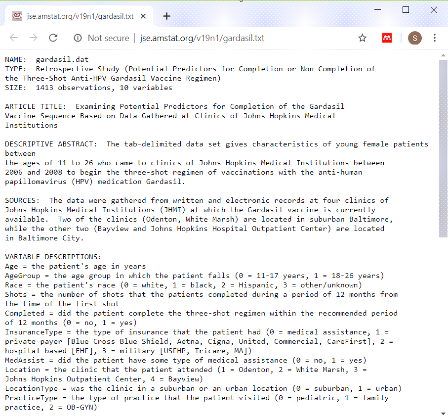
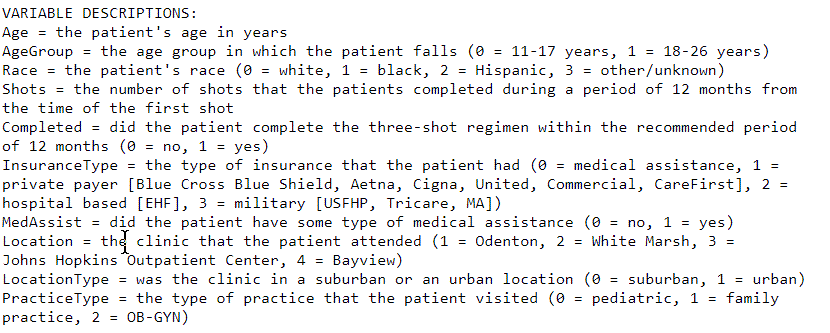
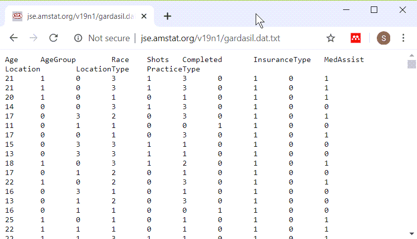
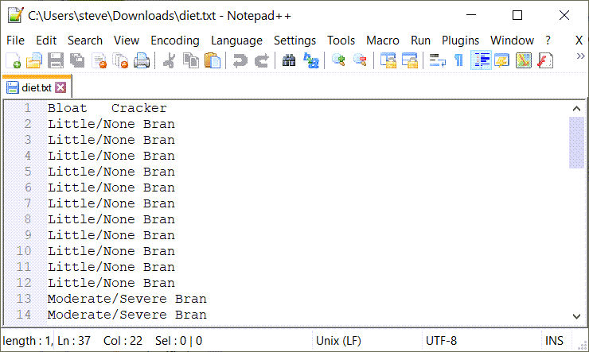

Having completed all the part 2 videos, I would like you to turn in some simple analyses that you run on two fresh data sets. This homework assignment will be graded pass/fail.

The Gardasil vaccine requires three shots in order to be effective. A study conducted at Johns Hopkins looked at how often patients failed to get all three shots. They wanted to see if insurance status, age, and other factors could predict who was at greatest risk for failing to get all three shots.

The data set is available at

http://www.amstat.org/publications/jse/v19n1/gardasil.dat.txt

An alternate format is available at

http://www.pmean.com/15/images/day2gardasil.csv

You can find a data dictionary at

http://www.amstat.org/publications/jse/v19n1/gardasil.txt

For every question, include the relevant R output and a brief written commentary explaining what the results mean. When you send your answers, please include the original questions (e.g., Q1: What is the 18th letter of the alphabet. A. The letter "R").

The diet dataset compares four different types of crackers. The subjects that ate the crackers rated them on the amount of bloating.

1. Create factors for AgeGroup, Race, Completed, Location. Show frequency counts for all four of these variables.

2. What proportion of patients completed all three shots?

3. Use a crosstabulation to compare Age to AgeGroup, and Location to LocationType. Are the recodings into AgeGroup and LocationType done properly?

4. Does the likelihood of completing all four shots vary by AgeGroup, Race, or Location? Calculate the appropriate percentages.

### For your homework

+ Gardasil dataset (Text file)
  + http://www.amstat.org/publications/jse/v19n1/gardasil.dat.txt
+ Gardasil dataset (Alternate text file)
  + http://www.pmean.com/15/images/day2gardasil.csv
+ Gardasil data dictionary
  + http://www.amstat.org/publications/jse/v19n1/gardasil.txt

The Gardasil vaccine requires three shots in order to be effective. A study conducted at Johns Hopkins looked at how often patients failed to get all three shots. They wanted to see if insurance status, age, and other factors could predict who was at greatest risk for failing to get all three shots.

Note to myself. I have not run through the analysis of this data set, yet, but it should have many of the same features as the Titanic data set, as almost all of the variables are categorical.

### Gardasil data dictionary

Here is the data dictionary. It is a bit hard to read so let me zoom in to the important section.

### Gardasil data dictionary

Almost all of the variables are categorical and they all use number codes.

### Gardasil data, text file

Here is the first version of the file. Notice the regular spacing throughout.

### Gardasil data, text file

### How should you read in this file?
+ First text format
  + Try tab separated file
+ Second text format
  + Try comma separated value
  

The data looks a bit unusual, but the relatively even spacing seems to indicate a tab delimited file. The second format is obviously a comma separated value format. You can tell by the file extension (csv) and by peeking at the file in a text editor.

### Diet data dictonary

This is a brief description of the file.

### Diet dataset

### How to read in this file
+ Is it space delimited or tab delimited?
  + Both! 
    + Tab on first line
    + Spaces on all others.
+ Possible solutions
  + Download and convert first line tab to one blank
  + Use default delimiter in read.table (white space)
    + read.table(fn, stringsAsFactors=FALSE)
    

This file is tricky.

