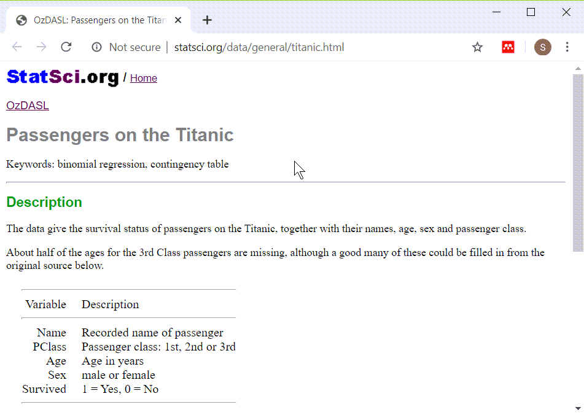

```{r setup, echo=FALSE}
knitr::opts_chunk$set(echo=TRUE)
```

### Introduction

This Powerpoint presentation was created using an R Markdown file. It is always a good idea to print the version of R and the current date as the very first few lines of any R program.

```{r r-version-and-current-date}
R.version.string
Sys.Date()
```

<div class="notes">

The version of R is stored in an internal constant, R.version.string. You can find the current data with the Sys.Date() function.

</div>

### The Titanic dataset

+ Titanic dataset
  + http://www.statsci.org/data/general/titanic.txt
+ Titanic data dictionary
  + http://www.statsci.org/data/general/titanic.html

<div class="notes">

You should find the data file on mortality among passengers of the Titanic at the website listed here. There is a pretty good data dictionary as well.

</div>

### Titanic data dictionary



<div class="notes">

There are five variables in this data set, the name of the passenger, the passenger class, the passenger age, sex, and whether they survived.

</div>

### What the file looks like


<div class="notes">

There are several hints that you may notice as you look at this file. Pssengers with longer name seem to be misaligned. Everything is left justified. It looks like when things do line up it is columns eight characters apart.

So let's try reading it in as a tab delimited file.

</div>

### Reading in the Titanic data set

```{r read}
fn <- "http://www.statsci.org/data/general/titanic.txt"
ti <- read.table(
  file=fn, header=TRUE, 
  stringsAsFactors=FALSE, sep="\t")
head(ti, n=4)
```

<div class="notes">

It reads in fairly well, it seems. The first few lines of data are hard to read because the passenger names are so long.

</div>

### Displaying without the names

```{r display}
head(ti[ , -1])
```

<div class="notes">

Notice how much nicer things look when you take out the column of names.

</div>

### Peek at the bottom also

```{r tail}
tail(ti[ , -1])
```

<div class="notes">

It's also a good idea to peek at the bottom of a data set right after you read it in. Sometimes a line in the middle gets out of sync and it throws the rest of the data off. If that happens then you will see weird things at the bottom of the data.

Notice that Miss Tamini Zabour has an "NA" for age.  We'll take a careful look at this.

</div>

### Descriptive statistics on age

```{r summary}
summary(ti$Age)
```

<div class="notes">

You learned how to get descriptive statistics for continuous variables in a previous module. The youngest passenger is `r min(ti$Age, na.rm=TRUE)` years old and the oldest is `r max(ti$Age, na.rm=TRUE)` years old. Let's peek at their data values.

</div>

### Print out information on youngest and oldest

```{r extremes}
ti[which.min(ti$Age), ]
ti[which.max(ti$Age), ]
```

<div class="notes">

The which.min and which.max functions simplify the task of finding the row or rows where a data value reaches its minimum or maximum.

Notice that the little baby survived, but not the old man.

</div>

### Categorical versus continuous variables

+ Categorical
  + Small number of possible values
  + Each value has a name or label
+ Continuous
  + Large number of possible values
  + Potentially any value in a range.
  
<div class="notes">

A categorical variable is defined (loosely) as a variable that has a small number of possible values. Each value is usually associated with a particular category or label. In contrast, a continuous variable is defined as a variable that has a large number of possible values, potentially any value in a particular interval.

In a previous module, almost all of the variables that you used were continuous. Today, almost all of the variables that you will use will be categorical.

The distinction between continuous and categorical variables is important in deciding what types of descriptive and inferential statistics you should use. But, there is often gray and fuzzy line between categorical and continuous variables. Don't worry too much about this today. If you're not sure whether a variable is categorical or continuous, try some simple descriptive statistics and graphs appropriate for categorical data and then try some simple descriptive statistics and graphs for continuous data. You will usually figure out quickly whehther treating your variable as categorical or continuous makes the most sense.

There are other types of variables also, such as count variables, that have their own special features.

</div>

### Freqency counts

```{r table-simple}
table(ti$PClass)
```

<div class="notes">

For categorical variables, you should first get frequency counts. A mean and standard deviation are usually meaningless for categorical data.

Unlike most other statistical packages, R tends to have a minimalist approach to statistics. If you asked for frequency counts in SAS or SPSS, these systems would automatically add percentages. R doesn't add percentages automatically.

This is something that you will either love or hate. You might think that SAS and SPSS are more thoughtful because almost every time you want a count, you'd also want the corresponding percentage. Or you might find it annoying to tell those programs to not clutter up your output with information you didn't want.

Personally, I don't like software deciding for me what I want. I'd rather ask for percentages explicitly when I need them rather than have them come as the default.

Now this is a rather trivial issue, but it does illustrate an important difference in philosophy. R makes you ask for the extras that you might need. SAS and SPSS force you to ask to NOT include things that they think are important.

So the table function produces only counts. 

</div>

### Proportions

```{r table-proportion}
tb <- table(ti$PClass)
prop.table(tb)
```

<div class="notes">

If you want percentages in addition to counts, there are several approaches.

The prop.table function takes a frequency table and converts it to a proportion.

</div>

### Percentages

```{r table-pct}
pct <- round(100*prop.table(tb))
pct
```

<div class="notes">

Multiply by 100 and round to get percentages.

</div>

### Percentages

```{r table-pct-sign}
pct.sign <- "%"
paste(pct,pct.sign,sep="")
```

<div class="notes">

You can get even fancier. The paste function concatenates several string variables and if something is not a string, R will convert it to a string before concatenating.

The "sep" parameter tells R what to put between the two values you are pasting together. By default it is a single blank character, but we don't want a blank between the number and the percent sign.

</div>

### Percentages

```{r table-names}
paste(names(pct),pct,pct.sign,sep="")
```

<div class="notes">

Somehow, the names of the passenger class got lost. So let's add them back in.

</div>

### Percentages

```{r table-punctuation}
colon <- ": "
paste(names(tb),colon,pct,pct.sign,sep="")
```

<div class="notes">

You can add spacing and a bit of punctuation to make the output look more readable.

</div> 

### Percentages

```{r fractions}
n  <- sum(tb)
slash <- "/"
comma <- ", "
paste(names(tb),colon,tb,slash,n,comma,pct,pct.sign,sep="")
```

<div class="notes">

Finally, you can combine the counts and the total with the percents to make things look really nice.

This shows how I like to program in R. First, get something simple. Then slowly add layers to it until you get a nice polished product.

In contrast, most other statistical packages try to produce polished results right from the start. This has some advantages, but the approach used by R, where many of the functions do something simple and basic, allows you to polish the results the way you want them.

</div>

### Tables that include counts of missing values.

```{r table-usena}
table(ti$PClass, useNA="always")
```

<div class="notes">

The default option in the table function is to not list missing values. During the intitial data screening, you should always look for missing values. This is done with the useNA parameter.

</div>

### Total count

```{r table-addmargins}
addmargins(table(ti$PClass,useNA="always"))
```

<div class="notes">

You can add a total count to the frequency table with the addmargins function.

</div>

### Summary function for categorical data

```{r summary5}
summary(ti$PClass)
summary(ti$Age)
```

<div class="notes">

Last time, we learned about the summary function, which produced the minimum, maximum, quartiles, mean, and missing value counts. Summary will actually look at the argument being passed to it and try to produce different summary statistics based on what the argument looks like. This, in technical terms, is an object-oriented feature of the R programming language (the use of classes and methods, to be more specific).

If the argument sent to summary is a character vector rather than a numeric vector, it will use frequency counts.

Sometimes this is very nice but sometimes it is not so nice.

</div>

### Summary

```{r summary3}
summary(ti$Sex)
summary(ti$Survived)
```

<div class="notes">

When you have a categorical variable that uses number codes, you need to either handle this as a special case, or you need to create a factor variable.

</div>

### Summary

```{r summary4}
ti$surv.factor <- factor(ti$Survived,levels=0:1,labels=c("No","Yes"))
summary(ti$surv.factor)
```

<div class="notes">

The factor function is similar to the variable label in SPSS and the format statement in SAS. It assigns category names (No and Yes) to numeric codes (0 and 1). It also has other features that are helpful in linear and logistic regression models, such as the ability to specify contrasts.

</div>

### Barplot

I'm not a big fan of bar plots, but they sometimes have their uses. You can get a barplot for the frequency count

```{r barplot}
barplot(table(ti$PClass))
```

or for the percentage (note the use of the ylab argument here).

### Barplot

```{r barplot2}
barplot(100*prop.table(table(ti$PClass)),ylab="Percent")
```

### Barplot

You can make things even nicer by pasting a percent sign on the vertical axis tick marks.

```{r barplot3}
barplot(100*prop.table(table(ti$PClass)),axes=FALSE)
axis(side=2,at=10*(0:5),labels=paste(10*(0:5),"%",sep=""))
```

### New categorical variables

```{r recode-simple}
ti$child <- as.numeric(ti$Age<18)
```

<div class="notes">

There are several ways to create a new categorical variable in R, but the easiest way is through the use of logical comparisons.

Suppose you wanted to compute a categorical variable called "child" which is equal to 1 if a passenger is less than 18 years old and 0 if a passenger is 18 or older. Here's one way to do it.

</div>

### Quality check

Anytime you create a new categorical variable, you should run a crosstabulation to check your results. Pay special attention to how missing values are handled. I'm only printing out the head and the tail to save space, but you should look at the entire table.

```{r recode-check}
chk <- table(ti$Age,ti$child,useNA="always")
head(chk)
tail(chk)
```

Note that since age has lots of values, we prefer to use that as the rows in the crosstabulation.

### On your own

Redfine a child as anyone under 21 years of age. Use the factor function to create labels of "adult" for 0 and "child" for 1. Are children more likely to survive than adults?

### More on recoding

Sometimes you want to combine two or more of the categories together. Here is how you might create a new passenger class variable with values of 1 for second and third class and 0 for first class.

The vertical bar (|) is the R symobl for logical OR.

As before, it's a good a idea to run a crosstabulation to verify that the new coding was done properly.

```{r recode-combine}
ti$lower.class <- as.numeric(ti$PClass=="2nd" | ti$PClass=="3rd")
table(ti$PClass,ti$lower.class)
ti$lower.class.factor <- factor(ti$lower.class, levels=c(0,1), labels=c("No", "Yes"))
```

### Creating multi-level categories

You can create multi-level categories using a complex logic system, but you can do it simpler and faster with the cut function.

```{r recode-cut}
ti$age.groups <- cut(ti$Age,breaks=c(0,2,6,9,12,19,99))
table(ti$age.groups,useNA="always")
table(ti$Age, ti$age.groups, useNA="always")
```

### Change labels

The notation used by cut may be familiar to mathematicians who know the difference between open and closed sets, but you can choose different labels.

```{r recode-cut-label}
lb <- c("Infant","Toddler","Child","Tween","Teenager","Adult")
ti$age.groups <- cut(ti$Age,breaks=c(0,2,6,9,12,19,99),labels=lb)
table(ti$age.groups,useNA="always")
lb <- c("Infant (up to 2 yrs)","Toddler (3 to 6 yrs)","Child (7 to 9 yrs)","Tween (10 to 12 yrs)","Teenager (13 to 19 yrs)","Adult (20 yrs and older")
```

### Save all my work

```{r save-image}
save.image("slides04.RData")
```
