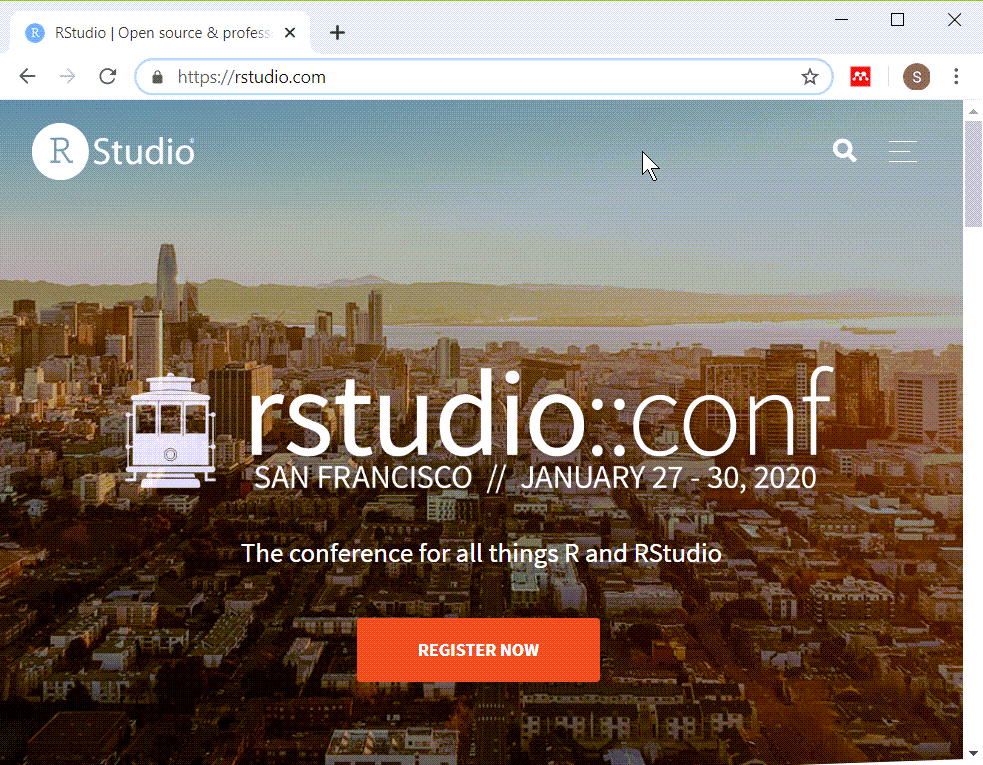

## Special note

+ This PowerPoint slide show was created using R.
  + Not complicated 
  + Buy beyond scope of this class
+ Source
  + https://github.com/pmean/introduction-to-r/tree/master/part1/src
+ A second resource
  + http://blog.pmean.com/powerpoint-with-r-markdown/
  
<div class="notes">

If you are viewing this PowerPoint presentation, I need to point out that it was developed using R. The process is not very complicated, but it is beyond the scope of this class. 

If you are curious, you can look at the code that I used to develop this
PowerPoint presentation. Or you can watch a short video on how this works.

But don't feel obligated to look at it. You will not be responsible for any of this in an introductory class.

It may seem a bit weird to have an R program that creates a PowerPoint presentation that talks about a different R program, but it works well for me.

</div>

## Installing R (https://cran.r-project.org/)


<div class="notes">

Here is the main page for CRAN. CRAN stands for the Comprehensive R Archive Network. This is where you can download a Linux, Mac, or Windows version of R. Ignore the source code. That is only needed for very advanced applications.

</div>

## Installing RStudio (https://rstudio.com/)



<div class="notes">


</div>

## Installing R and R Studio

+ R is required
+ RStudio is strongly recommended
+ Do not delay in getting this software installed
+ Find me if you have ANY problems

<div class="notes">

It should be very easy to install R and RStudio on your computer, but don't wait. Sometimes installations can get hung up and you won't be able to make any progress in this class without first getting the software installed.

If you have any problems at all with installation, see me right away.

</div>

## Recommended directory structure (1/2)


<div class="notes">

Here is the directory structure that I use. You do not have to follow this structure, but it is recommended, not by me, but by the expert programmers at a group known as Software Carpentry. I'll elaborate in greater detail about this later, but wanted to mention it now. If you are relatively new to programming, you want to start off using good programming practices. A standardized directory structure helps a lot with this especially if you are working with others.

</div>

## "A place for everything, everything in its place"

+ dat
  + raw data files
  + intermediate data files
+ doc
  + documentation
+ images
  + graphs
+ results
  + program output
+ src
  + program code
  
<div class="notes">

The quote at the top of the slide is an organizational principle espoused by Benjamin Franklin. If you've seen my office, you'll know that I am probably the last person to lecture you on organization. But I have found that a standardized directory structure has made my life a lot easier.

The dat folder contains any raw data files. It's also where I put intermediate files, files that I create and save for later re-use. Some people put intermediate files in the results folder, and that's a fine alternative. Just be sure to be consistent about it.

The doc folder contains any documentation associated with the work. The IRB approved protocol, if I have one, will go here. If I am working with someone and they send me a paper that helps describe the type of data analysis they want, I put it in this folder. I also print key emails from the other team members to pdf format and store them here as well.

If my programs produce any graphs, I will store them in the images folder. I use screenshots of various web pages a lot in my work and I put those here as well.

I usually store program output in the results folder, but not always, for reasons I don't want to get into.

The program code goes in the src folder.

</div>

## Anatomy of a small R program (1/5)

+ Rmarkdown code

```{r echo=FALSE, comment=""}
suppressMessages(suppressWarnings(library(stringr)))
tx <- readLines("small_program.Rmd", warn=FALSE)
header_lines <- str_which(tx, "---")
backtick_lines <- str_which(tx, "``")
beg_line <- header_lines[1]
end_line <- header_lines[2]
cat(paste0(tx[beg_line:end_line], collapse="\n"))
```

<div class="notes">

Here is the typical header for an Rmarkdown program.

</div>

## Anatomy of a small program (2/5)

+ Rmarkdown code

```{r echo=FALSE, comment=""}
beg_line <- end_line+1
end_line <- backtick_lines[1]-1
cat(paste0(tx[beg_line:end_line], collapse="\n"))
```

## Anatomy of a small program (3/5)

+ Rmarkdown code

```{r echo=FALSE, comment=""}
beg_line <- end_line+1
end_line <- backtick_lines[2]
cat(paste0(tx[beg_line:end_line], collapse="\n"))
```

## Anatomy of a small program (4/5)

+ Rmarkdown code

```{r echo=FALSE, comment=""}
beg_line <- end_line+1
end_line <- backtick_lines[3]-1
cat(paste0(tx[beg_line:end_line], collapse="\n"))
```

## Anatomy of a small program (4/5)

+ Rmarkdown code

```{r echo=FALSE, comment=""}
beg_line <- end_line+1
end_line <- backtick_lines[4]
cat(paste0(tx[beg_line:end_line], collapse="\n"))
```

## More documentation

You are viewing a Powerpoint presentation created using R Markdown. The author (me!) and the creation date are listed on the title slide. You can find this program on [my github site]() and it is free for you (or anyone) to use or modify as you like with no restrictions. If you use this on your own web page or in a publication, a brief acknowledgement is appreciated, but it is not required.

This program is part of a series of R programs for the Introduction to R class. This program shows you how to read a simple text file.

## Additional documentation

```{r version-and-current-date}
R.version.string
Sys.Date()
```

<div class="notes">

When I care enough to include documentation in my program, I use the two commands listed above to remind myself what version of R I am using and the date when the program was run.

</div>

## A brief comment about R Markdown.

This file is written in R Markdown, a mixture of R commands and commentary. Lines surrounding the R commands start with three backquotes. The line at the top will also have curlybraces a lower case "r" and brief descriptive names of the code segment (e.g., read). The backquotes and curly braces allow me to produce a nicely formatted html file that intersperses the R commands, the R output, and the commentary.

You can safely ignore the backquotes and curly braces. Use cut-and-paste from a text editor like notepad to run the appropriate commands without having to retype them. Please cut-and-paste the thre lines below into the R console.

```{r simple-example}
x <- 1:9
x
summary(x)
```

You are not responsible for R Markdown in this class, but I wanted to show you one of the features of R Markdown. When you create objects in R, you can print those objects, as shown above, or you can incorporate those objects in your commentary. Here's an example.

Our data set has values `r x`. The mean is `r mean(x)` and the standard deviation is `r sd(x)`

## Cleaning house

When I start up a new program, I usually take the time to remove any objects that might be left over from a previous program. It isn't really necessary, but sometimes it can help avoid some problems. You can take a look at what objects are currently available in memory with the ls function and you can remove some or all of these objects with the rm function.

```{r clean-house}
ls()
rm(list=ls()) # This list=ls() option removes everything
```

## Some definitions

A **categorical variable** is a variable that can only take on a small number of values. Each value is usually associated with a particular category.

Examples of categorical variables are

* sex (Male or Female),
* race/ethnicity (Caucasian, African American, Hispanic, etc.),
* cancer stage (I, II, III, or IV),
* birth delivery type (Vaginal, C-section). 

A **continuous variable** is a variable that can take on a large number of possible values, potentially any value in some interval.

Examples of continuous variables are

* Birth weight in grams,
* gestational age,
* fasting LDL level.

There are some variables that are on the boundary between categorical and continuous, but it is not worth quibbling about here. 

The point to remember is that the types of graphs that you use and the types of statistics that you compute are dependent on many things, but first and foremost on whether the variables are categorical, continuous, or a mixture.

Today, you will see examples involving mostly continuous variables.

The first data set we will work with shows data various body measurements. A brief description of this file is available at

--> http://www.amstat.org/publications/jse/datasets/fat.txt

You need to read in the file using the read.table function.

```{r read}
fn <- "http://www.amstat.org/publications/jse/datasets/fat.dat.txt"
fd <- read.table(file=fn)
head(fd)
tail(fd)
```

R has many of the features of an object-oriented language, but it is not a true object-oriented programming language. There are a variety of objects in R like vectors, lists, matrices, and arrays, that are useful for storing, manipulating, and analyzing research data. We will spend most of this class using a particular object, the data frame.

The object, fd, that you just created with the read.table function is a data frame. Data frames are rectangular grids of data. Each column in the data frame has the same length. A data frame can store data of various types (numeric, character, and dates are the most common types of data). The data within a column has to have the same type, but the different columns can have different data types.

There are times when the rectangular grid of a data frame is too restrictive for your data, and R has other ways of storing this data (most notably, lists), but you will find that for most data analyses, a data frame will work just fine.

The head function shows the first few rows of the data set and the tail function shows the last few rows of the data set.

Always get in the habit of checking out the very bottom of your data frame. It's a common location for glitches.

This data set did not have a header, a line at the very top of the file that lists variable names. R uses the default names V1, V2, etc. As a general rule, you should use brief (but descriptive) names for every variable in your data set. The names should be around 8 characters long. Longer variable names make your typing tedious and much shorter variable names makes your code terse and cryptic.

You should avoid special symbols in your variable names especially symbols that are likely to cause confusion (the dash symbol, for example, which is also the symbol for subtraction). You should also avoid blanks. These rules are pretty much universal across most statistical software packages. If you violate these rules, you will find out that, at a minimum, you will always have to surround your variable name by quotes to avoid problems.

There are times when you'd like to have a blank in your variable name and you can use two special symbols that you can use in R (and most other statistical pacakges), the underscore symbol (above the minus key on most keyboards) and the dot (period). These symbols create some artificial spacing that mimics the blanks. Another approach is "CamelCase" which is the mixture of upper and lower case within a variable name with each uppercase designating the beginning of a new "word".

The names function will display the variable names in your data set.

```{r names-1}
names(fd)
```

You also can use the names function to create a different set of variable names.

```{r names-2}
names(fd) <- c("case","fat.b","fat.s","dens","age","wt","ht","bmi","ffw","neck","chest","abdomen","hip","thigh","knee","ankle","biceps","forearm","wrist")
```

I'm a bit more terse with these variable names than I normally would be just to reduce the amount of typing you have to do.

Now, when you display part or all of your data frame, the new names will help you navigate successfully through it.

```{r names-3}
head(fd)
```

Most statistical packages allow you to provide a longer description for each variable in your dataset (a variable label, for example, in SPSS). The longer descriptions have almost no restrictions on blanks or special symbols and are useful for documenting the units of measurement for your variable, among other things. R does not have a formal equivalent to the SPSS variable label.

We'll talk about additional documentation requirements for categorical data in part 2 of this class.

I'm going to take a short break and you can also. Before you take your break, save your work. The save.image function stores a binary version of all your objects.

```{r save-everything}
save.image(file="../results/part1.RData")
```

Before you go, answer the following quiz questions.

http://www.pmean.com/15/images/quiz1a.html

Send the answers to the quiz by email with the subject line

Introduction to R, (your name), quiz 1a.