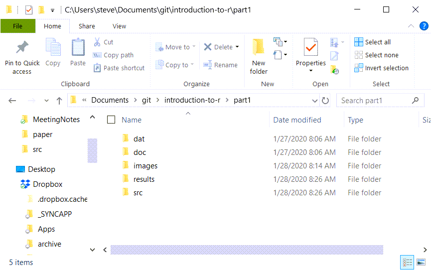
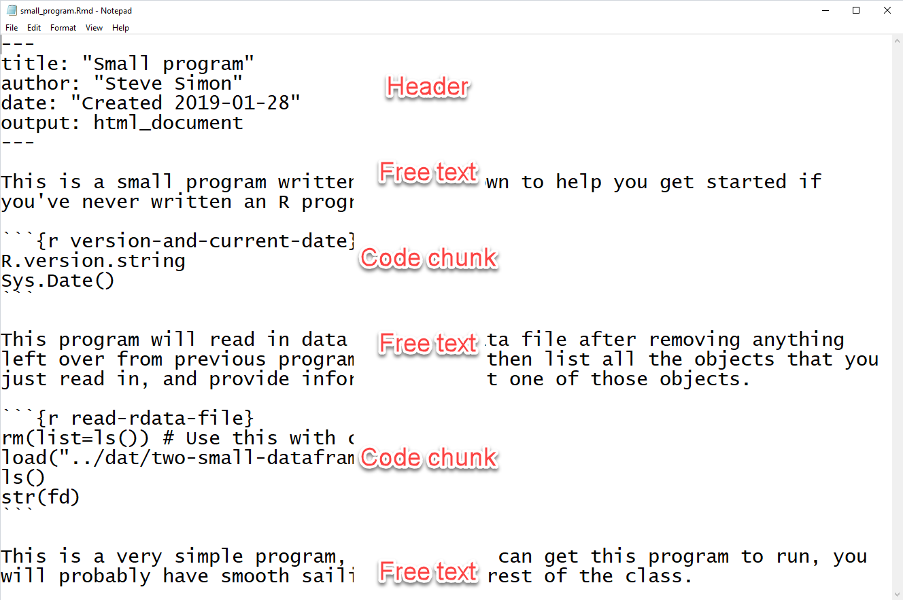
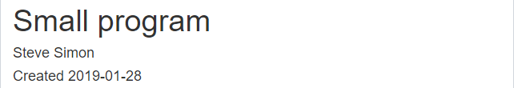

## Special note

+ This PowerPoint slide show was created using R.
  + Not complicated 
  + But beyond scope of this class
+ Source
  + https://github.com/pmean/introduction-to-r/tree/master/part1/src
+ A second resource
  + http://blog.pmean.com/powerpoint-with-r-markdown/
  
<div class="notes">

If you are viewing this PowerPoint presentation, I need to point out that it was developed using R. The process is not very complicated, but it is beyond the scope of this class. 

If you are curious, you can look at the code that I used to develop this
PowerPoint presentation. Or you can watch a short video on how this works.

But don't feel obligated to look at it. You will not be responsible for any of this in an introductory class.

It may seem a bit weird to have an R program that creates a PowerPoint presentation that talks about a different R program, but it works well for me.

</div>

## Installing R (https://cran.r-project.org/)


<div class="notes">

Here is the main page for CRAN. CRAN stands for the Comprehensive R Archive Network. This is where you can download a Linux, Mac, or Windows version of R. Ignore the source code. That is only needed for very advanced applications.

</div>

## Installing RStudio (https://rstudio.com/)


<div class="notes">


</div>

## Installing R and R Studio

+ R is required
+ RStudio is strongly recommended
+ Do not delay in getting this software installed
+ Find me if you have ANY problems

<div class="notes">

It should be very easy to install R and RStudio on your computer, but don't wait. Sometimes installations can get hung up and you won't be able to make any progress in this class without first getting the software installed.

If you have any problems at all with installation, see me right away.

</div>

## Recommended directory structure



<div class="notes">

Here is the directory structure that I use. You do not have to follow this structure, but it is recommended, not by me, but by the expert programmers at a group known as Software Carpentry. I'll elaborate in greater detail about this later, but wanted to mention it now. If you are relatively new to programming, you want to start off using good programming practices. A standardized directory structure helps a lot with this especially if you are working with others.

</div>

## "A place for everything, everything in its place"

+ dat
  + raw/intermediate data files
+ doc
  + documentation
+ images
  + graphs
+ results
  + program output
+ src
  + program code
  
<div class="notes">

The quote at the top of the slide is an organizational principle espoused by Benjamin Franklin. If you've seen my office, you'll know that I am probably the last person to lecture you on organization. But I have found that a standardized directory structure has made my life a lot easier.

The dat folder contains any raw data files. It's also where I put intermediate files, files that I create and save for later re-use. Some people put intermediate files in the results folder, and that's a fine alternative. Just be sure to be consistent about it.

The doc folder contains any documentation associated with the work. The IRB approved protocol, if I have one, will go here. If I am working with someone and they send me a paper that helps describe the type of data analysis they want, I put it in this folder. I also print key emails from the other team members to pdf format and store them here as well.

If my programs produce any graphs, I will store them in the images folder. I use screenshots of various web pages a lot in my work and I put those here as well.

I usually store program output in the results folder, but not always, for reasons I don't want to get into.

The program code goes in the src folder.

</div>

## Anatomy of a small R program, overview


<div class="notes">

This is a full listing of a small program written in Rmarkdown. The font is too small to read. Don't worry, I just wanted you to see the full picture. I'll look at small pieces of this program using a readable font size.

</div>

## Anatomy of a small R program, header

+ Rmarkdown code

```{r echo=FALSE, comment=""}
suppressMessages(suppressWarnings(library(stringr)))
tx <- readLines("small_program.Rmd", warn=FALSE)
header_lines <- str_which(tx, "---")
backtick_lines <- str_which(tx, "``")
eof_line <- length(tx)
beg_line <- header_lines[1]
end_line <- header_lines[2]

cat(paste0(tx[beg_line:end_line], collapse="\n"))
```

<div class="notes">

Here is the typical header for an Rmarkdown program.

</div>

## Anatomy of a small program, free text comments

+ Rmarkdown code

```{r echo=FALSE, comment=""}
beg_line <- end_line+1
end_line <- backtick_lines[1]-1
cat(paste0(tx[beg_line:end_line], collapse="\n"))
```

## Anatomy of a small program, code chunk

+ Rmarkdown code

```{r echo=FALSE, comment=""}
beg_line <- end_line+1
end_line <- backtick_lines[2]
cat(paste0(tx[beg_line:end_line], collapse="\n"))
```

## Anatomy of a small program, second set of free text comments

+ Rmarkdown code

```{r echo=FALSE, comment=""}
beg_line <- end_line+1
end_line <- backtick_lines[3]-1
cat(paste0(tx[beg_line:end_line], collapse="\n"))
```

## Anatomy of a small program, second code chunk

+ Rmarkdown code

```{r echo=FALSE, comment=""}
beg_line <- end_line+1
end_line <- backtick_lines[4]
cat(paste0(tx[beg_line:end_line], collapse="\n"))
```

## Anatomy of a small program, third set of free text comments

+ Rmarkdown code

```{r echo=FALSE, comment=""}
beg_line <- end_line+1
end_line <- eof_line
cat(paste0(tx[beg_line:end_line], collapse="\n"))
```

<div class="notes">

After the second chunk of R code, I add a couple of extra comments.

</div>

## Anatomy of a small program, review



<div class="notes">

Here is the full program again. You can see that it starts with a header, and alternates between free text and R code.

</div>

## Program output, overview


<div class="notes">

Here is the full output. The fonts are too small to read, so let's zoom in again on individual pieces.

</div>

## Program output, header



<div class="notes">

This is the header. It displays the title, author, and date from the code header.

</div>

## Program output, free text


<div class="notes">

This is first set of free text. Rmarkdown will reflow the text, if needed, to fit inside the margins.

</div>

## Program output, code chunk


<div class="notes">

This is the first code chunk. By default, Rmarkdown will display the individual commands in a gray box, followed by the output in a white box.

</div>

## Program output, more free text


<div class="notes">

This is second set of free text.

</div>

## Program output, second code chunk


<div class="notes">

This is the second code chunk. It displays the title, author, and date from the code header.

</div>

## Program output, last set of free text


<div class="notes">

This is last set of free text.

</div>

## Review

+ In this video, you saw
  + Installation pages for R, RStudio
  + Anatomy of a small program
  + Output from the small program
+ Review Canvas for the work assigned to this module

<div class="notes">

This is a very basic start. You saw the web pages where you install R and RStudio from. Then you saw the pieces of a small program written in Rmarkdown, as well as the output.

Take a look at Canvas, please, to see the work that you need to do for this module.

</div>
