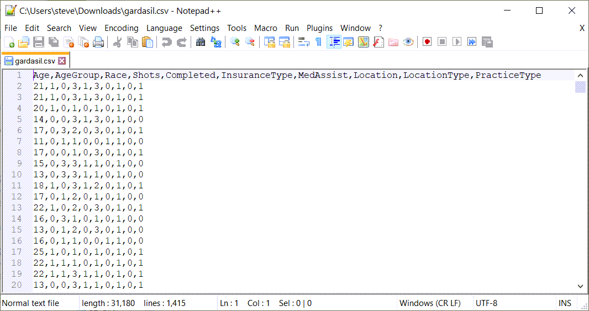
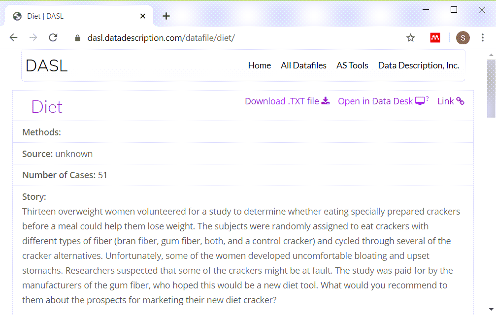

Having completed all the videos in this module, I would like you to turn in some simple analyses that you run on two fresh data sets. This homework assignment will be graded pass/fail.

For every question, include the relevant R output and a brief written commentary explaining what the results mean. When you send your answers, please include the original questions (e.g., Q1: What is the 18th letter of the alphabet. A. The letter "R").

The first four questions relate to the Gardasil dataset, a study of patients who received the Gardasil vaccine. A key question that this dataset was intended to address is what factors influenced whether a patient got all the required shots. More details are given below.

1. Create factors for AgeGroup, Race, Completed. Show frequency counts for all four of these variables.

2. What percentage of patients completed all three shots?

3. Use a crosstabulation to compare Age to AgeGroup. Are the recodings into AgeGroup done properly?

4. Does the likelihood of completing all four shots vary by AgeGroup or Race? Calculate the appropriate percentages.

The next two questions relate to the diet dataset that compares four different types of crackers. The 13 subjects that ate the crackers rated them on the amount of bloating. More details are given below.

5. Calculate frequency tables for both categorical variables in the dataset. Are there any missing values?

6. Calculate a crosstabulation with nicely rounded percentages. Try to arrange the rows and columns and percentages so that your table best addresses the question, what type of cracker had the most and the least bloating.

### Gardasil dataset

+ Gardasil dataset (Text file)
  + http://www.amstat.org/publications/jse/v19n1/gardasil.dat.txt
+ Gardasil dataset (Alternate text file)
  + http://www.pmean.com/15/images/day2gardasil.csv
+ Gardasil data dictionary
  + http://www.amstat.org/publications/jse/v19n1/gardasil.txt

The Gardasil vaccine requires three shots in order to be effective. A study conducted at Johns Hopkins looked at how often patients failed to get all three shots. They wanted to see if insurance status, age, and other factors could predict who was at greatest risk for failing to get all three shots.

### Gardasil data dictionary

Here is the data dictionary. Almost all of the variables are categorical and they all use number codes.

### Gardasil data, text file

Here is the first version of the file. Notice the regular spacing throughout. But also notice how the first line, the names of the variables don't quite line up.

### Gardasil data, text file

Here's a view of the alternate format.

### How should you read in this file?

The data looks a bit unusual, but the relatively even spacing, except for the first line seems to indicate a tab delimited file. The second format is obviously a comma separated value format. You can tell by the file extension (csv) and by peeking at the file in a text editor.

### Diet dataset

+ Diet dataset (Text file)
  + https://dasl.datadescription.com/download/data/3163
+ Diet data dictionary
  + http://dasl.datadescription.com/datafile/diet

### Diet data dictonary

This is a brief description of the file.

### Diet dataset

### How should you read in this file?

The data looks a bit unusual, but the relatively even spacing seems to indicate a tab delimited file. The hint that it is not a fixed width file is in the very first line, where the variable name Cracker does not line up with data directly beneath it.
