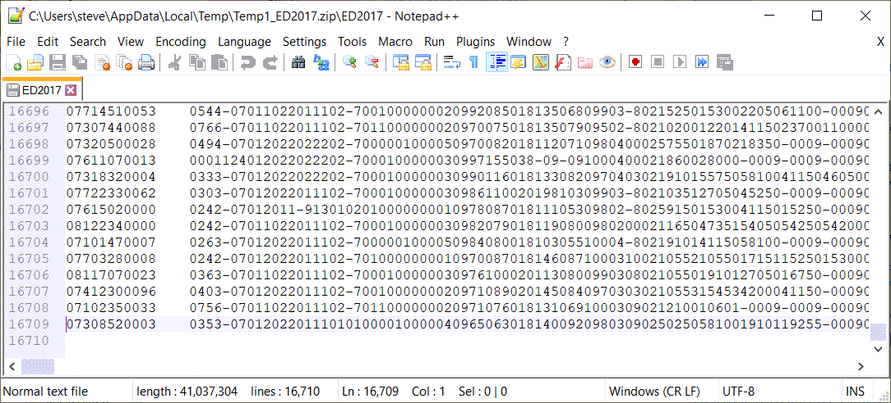

```{r echo=FALSE}
suppressMessages(suppressWarnings(library(stringr)))
options(width=45)
```

### Text files
+ Advantages
  + Easy import into many programs
  + Review using notepad
+ Wide range of formats
  + Delimited
  + Fixed width
+ First row for variable names
  + Optional but recommended
+ Always look for a data dictionary

<div class="notes">

One of the most important skils you will learn in this class is how to read data from text files. Text files are commonly used for data storage because they are easily imported into a variety of different programs. You can often peek at a text file using a simple program like Notepad in order to get a quick feel for what the data looks like.

Text files come in a variety of format. A delimited file uses a special character, often a comma, to designiate where one data value ends and the next one begins. In contrast, a fixed width file requires every variable to occupy a particular column or columns.

Many text files include the names of the variables in the first row of text. This is not required, but it is strongly recommended.

</div>

### Read in comma separated values

+ Type the following into notepad.

```{r csv, echo=FALSE, comment=""}
tx <- readLines("../data/simple.csv")
cat(tx, sep="\n")
```

+ Save it
  + in the dat directory
  + filename: simple.csv

<div class="notes">

In notepad or another text editor, type in the following
values.

x,y

1,4

2,8

3,12

4,16

and save the file using the name simple.csv. Note the directory that you are saving it in. Ideally, it should be in a folder named "dat."


</div>

### the read.csv function 

```{r read-csv}
fn <- "../data/simple.csv"
raw_data <- read.csv(file=fn, 
  stringsAsFactors=FALSE)
raw_data
```

<div class="notes">

Comma separated files are so common that R has several dedicated functions for reading them. The simplest function is read.csv. It The best fuctions are in the readr library.

We will not talk about it in this module, but you almost always want to use the option stringsAsFactors=FALSE.

</div>

### Space delimited files

+ Type the following into notepad.

```{r space-delimited, echo=FALSE, comment=""}
tx <- readLines("../data/simple.txt")
cat(tx, sep="\n")
```

+ Save it
  + in the dat directory
  + filename: simple.txt

<div class="notes">

Now try something different. Type in the same data, but use a single space between each number rather than a comma.

</div>

### Using the read.table function

```{r txt}
fn <- "../data/simple.txt"
raw_data <- read.table(fn, header=TRUE, stringsAsFactors=FALSE, sep=" ")
raw_data
```

<div class="notes">

Review the options for the read.table command.

Type in the same data, but using the tilde (~) as a separator (e.g., 1~4). Save the file as tilde.txt.

Here is how you would use read.table to read this file.

</div>

### Tab delimited files

+ Type the following into notepad, but everywhere you see a space, press the tab key instead of the space bar.

```{r tab, echo=FALSE, comment=""}
tx <- readLines("../data/simple.tsv")
cat(tx, sep="\n")
```

+ Save it
  + in the dat directory
  + filename: simple.tsv

<div class="notes">

</div>

### Using the read.table function

```{r tsv}
fn <- "../data/simple.tsv"
raw_data <- read.table(fn, header=TRUE, stringsAsFactors=FALSE, sep="\t")
raw_data
```

### Anything can be a delimiter

+ Type the following into notepad

```{r anything, echo=FALSE, comment=""}
tx <- readLines("../data/tilde.txt")
cat(tx, sep="\n")
```

+ Save it
  + in the dat directory
  + filename: tilde.txt


<div class="notes">

Type in the same data, but using the tilde (~) as a separator (e.g., 1~4). Save the file as tilde.txt.

Here is how you would use read.table to read this file.

</div>

### Using the read.table function

```{r tilde}
fn <- "../data/tilde.txt"
raw_data <- read.table(fn, header=TRUE, stringsAsFactors=FALSE, sep="~")
raw_data
```

<div class="notes">

The data reads in just fine. Why would you use a tilde as a delimiter. Sometimes your data itself includes delimiters like spaces and commas, and then you might want to choose an obscure out of the way symbol to serve as a delimiter.

</div>

### Reading fixed width format files

+ Type the following into notepad
  + Space between the 1 and 4
  + Space between the 2 and 8
  + No space between the 3 and 12
  + No space between the 4 and 16

```{r fixed, echo=FALSE, comment=""}
tx <- readLines("../data/fixed.txt")
cat(tx, sep="\n")
```

+ Save it
  + in the dat directory
  + filename: fixed.txt


<div class="notes">

Here's another variation.

Sometimes you will get a file with no delimiters to save space. This requires that each variable takes up a fixed number of columns and that information is often specified in a separate file.

Create a fixed width file in notepad with the following lines.

1 4

2 8

312

416

and store it as fixed.txt.

</div>

### The read.fwf function 

```{r read.fwf}
fn <- "../data/fixed.txt"
raw_data <- read.fwf(fn, c(1, 2))
raw_data
```

<div class="notes">

You should also consider the read.fortran function. Check out the help file.

</div>

### Writing text files

+ Similar structure to read functions
  + write.csv
  + write.table

<div class="notes">

If you want to write a text file, you can use either the write.csv or write.table functions. Look up the help files on these functions. We'll create a small data frame and store it in a comma delimited and tab delimited format.

</div>

### Writing text files 

```{r write-text}
raw_data <- data.frame(x=c(1, 2, 3, 4), y=c(4, 8, 12, 16))
fn <- "../results/output_data.txt"
write.table(raw_data, fn, row.names=FALSE)
```

<div class="notes">

Open these files in notepad to see what they look like.

</div>

### Writing text files

```{r output1, echo=FALSE}
tx <- readLines(fn)
cat(tx, sep="\n")
```

<div class="notes">

If you opened up the data in notepad or some other program, you would see a space delimited file. You can change the delimiter, among other things

</div>

### Example #1

+ https://stats.idre.ucla.edu/stat/data/binary.csv

```{r ex1, echo=FALSE}
fn <- "https://stats.idre.ucla.edu/stat/data/binary.csv"
tx <- readLines(fn)
cat(tx[1:6], sep="\n")
```

<div class="notes">

Here is the first real-world example. Peeking at the first six lines of data, you can see clearly that it is uses comma delimiter and the first row of data contains the variable names.

</div>


### Example #1

+ No formal data dictionary, but here is a description
  + "This dataset has a binary response (outcome, dependent) variable called admit. There are three predictor variables: gre, gpa and rank. We will treat the variables gre and gpa as continuous. The variable rank takes on the values 1 through 4. Institutions with a rank of 1 have the highest prestige, while those with a rank of 4 have the lowest."
  + Description found at https://stats.idre.ucla.edu/r/dae/logit-regression/
  
<div class="notes">

There is no formal data dictionary, which is a shame, but you can find a brief description on a second page where this data set is used.

</div>

### Example #1

```{r read-binary}
fn <- "https://stats.idre.ucla.edu/stat/data/binary.csv"
mydata <- read.csv(fn, stringsAsFactors=FALSE)
head(mydata)
```

<div class="notes">

The read.csv file does a fine job here. I am only printing the first few rows of the data.

</div>

### Example #2


<div class="notes">

This is a second dataset. Looking at it in notepad, it looks like it is a tab delimited file.

</div>

### Example #2

+ No data dictionary
  + Brief description: "At a barbershop music singing competition, choruses are judged on three scales: Music (quality of the arrangement, etc.), Performance, and Singing."
  + Description found at https://dasl.datadescription.com/datafile/barbershop-music/

### Example #2

```{r read-tsa-3}
fn <- "https://dasl.datadescription.com/download/data/3061"
mydata <- read.table(
  fn, header=TRUE, sep="\t", 
  stringsAsFactors=FALSE)
head(mydata)
```

<div class="notes">

The read.table command works well here. The separator or delimiter is the tab character, which is coded in R as \t.

</div>

### Example #3


<div class="notes">

This is a third data set. Notice that there are no variable names at the top of the file.

</div>

### Example #3

+ Data dictionary at http://jse.amstat.org/datasets/airport.txt. Here is an excerpt.

```{}
VARIABLE DESCRIPTIONS:
Airport                          Columns 1-21
City                             Columns 22-43 
Scheduled departures             Columns 44-49 
Performed departures             Columns 51-56
Enplaned passengers              Columns 58-65
Enplaned revenue tons of freight Columns 67-75
Enplaned revenue tons of mail    Columns 77-85
```

<div class="notes">

This dataset has a very nice data dictionary. From the description, you can tell that it is a fixed width format.

</div>

### Example #3

```{r airport}
fn <- "http://jse.amstat.org/datasets/airport.dat.txt"
raw_data <- read.fwf(fn, 
  c(21, 22, 6, 7, 9, 10, 10), header=FALSE)
head(raw_data, 2)
```

<div class="notes">

You have to do a bit of math here. If the first variable ends in column 21 and the second variable ends in column 43, then the number of columns for the second variable is 43-21.

</div>

### Should I download before reading?
+ Read directly from website
  + Convenient
  + Updates incorporated at each run
+ Download then read
  + Downloaded file doesn't disappear
  + Avoid repeated long downloads
  + Work even when Internet connection is down
  
<div class="notes">

R gives you the option of reading a file on your computer or reading it from a website. For small datasets that you only use once (such as for your homework assignments), it doesn't matter. For larger files and repeated data analyses, there are some advantages to reading directly from the website and some advantages to downloading the file to your computer. 

Reading directly from the website is convenient. You don't have to figure out where to store your downloaded file. If the website updates the file on a regular basis, reading directly always insures that you have the most current data.

If you download the file and then read it, you provide yourself with some insurance against the website disappearing. If the download takes a long time, then you only have to endure that delay once. Finally, a downloaded file allows you to work when an Internet connection is not available, such as during a plane flight (though many airlines will now let you connect while in the air).

</div>

### Disadvantages of fixed width formatting?
+ Confusing
  + What is 312? 3, 1, and 2? 31, and 2? 3 and 12? 312?
+ More work
+ Prone to errors

<div class="notes">

When you have no delimiters, it is easy to get confused. The third line, for example, of our simple data file is "312". That could be three numbers: 3, 1, and 2. It could be two numbers: 31 and 2? Or maybe 3 and 12? Or it could be a single number: 312. In a small dataset, you won't get confused, but you might with a larger dataset.

It's also more work because you have to specify the number of columns that each variable uses. That's not trivial for a large file.

The fixed width format is also more prone to errors. If you get the columns wrong, you might truncate some of your data.

</div>

### Example where fixed width formatting is needed.



<div class="notes">

Here's practical example where you really might need fixed width formatting. This is data from Emergency Department visits in a CDC survey. There are over 16,000 rows, which is bad enough. But each row (except the last one) has over 2,400 columns. These columns contain information for over 900 variables.

If you were to use delimiters in this file, you'd have to add 900 commas or 900 tabs or 900 spaces or 900 tildes to each and every line. That works out to be 1.4 million commas across the entire file. That's a substantial increase to the size of an already very large and unwieldy file.

</div>

### No data dictionary?
+ Peek at file
  + Same number of delimiters on each line
+ Tabs versus multiple blanks are hard to distinguish
  + Tab delimited?
  + Space delimited?
  + Fixed width format?
  + http://www.pmean.com/12/pesky.html

<div class="notes">

Many files that you find on the Internet are missing any documentation or the documentation fails to help you figure out what approach to use to import the data. If that's the case, don't despair. There are several common sense things you can try.

First, peek at the file and see if there are any obvious delimiters. It's important that you have the exact same number of delimiters on each line of data. If you think the comma is the delimiter, then if there are five commas on one line, then every line should have five commas. The exception would be delimiters found inside quotes.

Tabs versus multiple blanks are hard to distinguish. This sometimes means that you will have difficulty telling whether to use a tab delimited file, a space delimited file, or a fixed width file. I have a web page that talks about this in detail. 

</div>

### No data dictionary?
+ Experiment
  + Read warnings carefully
+ If needed, edit the file manually
  + Simple edits of one or two offending lines
  + Global search and replace
    + Change tabs to blanks
    + Change multiple blanks to single blank

<div class="notes">

There's nothing wrong with experimenting. Just pick one approach and try it. If you get an error message or the data is garbled, try a different approach. If you get warnings rather than errors, things may be okay, but look carefully at the warning message and double your vigilance efforts before you start analysis.

If all else fails, go in and edit the file manually. This helps if there are just a couple of rows in the file that are causing you heartburn. Usually the error or warning message will give you enough of a hint that you locate the offending lines. If there are problems on every line or almost every line, then sometimes a global search and replace works well.

</div>

### Summary
+ read.csv for comma delimited files
+ read.table for other delimiters
  + Beware the tab
+ read.fwf for fixed width files
+ write with write.csv, write.table

<div class="notes">

Read data from text files is an important survival skill in R. Use the read.csv function for comma-delimited files. This is the most common format for text files.

Use read.table for other delimiters. Watch out for tab delimited files.

Use read.fwf for fixed width files.

If you need to write text files, the write.csv and write.table functions provide options similar to the two read functions.

</div>
