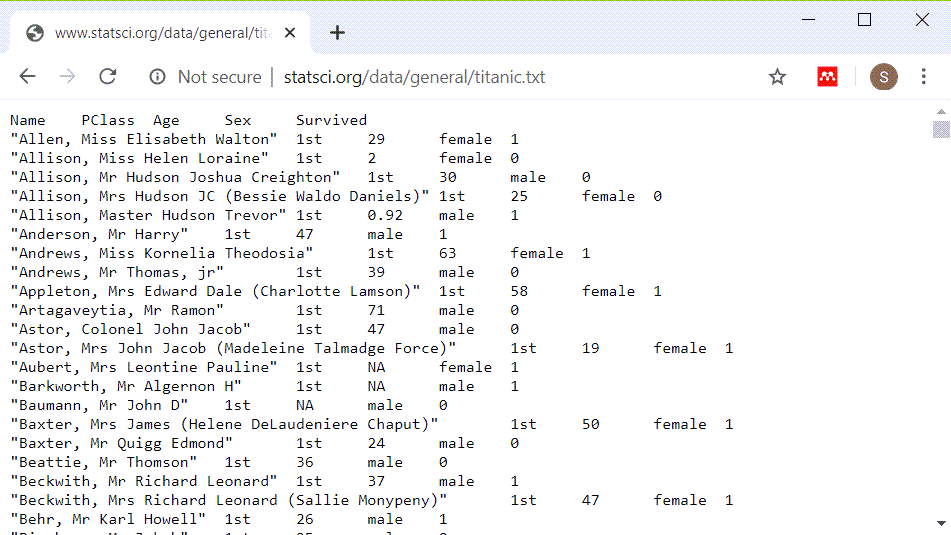

```{r setup, echo=FALSE}
knitr::opts_chunk$set(echo=TRUE)
``` 

### Introduction

This Powerpoint presentation was created using an R Markdown file. It is always a good idea to print the version of R and the current date as the very first few lines of any R program.

```{r r-version-and-current-date}
R.version.string
Sys.Date()
```

<div class="notes">

The version of R is stored in an internal constant, R.version.string. You can find the current data with the Sys.Date() function.

</div>

### The Titanic dataset

+ Titanic dataset
  + http://www.statsci.org/data/general/titanic.txt
+ Titanic data dictionary
  + http://www.statsci.org/data/general/titanic.html

<div class="notes">

You should find the data file on mortality among passengers of the Titanic at the website listed here. There is a pretty good data dictionary as well.

</div>

### Titanic data dictionary


<div class="notes">

There are five variables in this data set, the name of the passenger, the passenger class, the passenger age, sex, and whether they survived.

</div>

### What the file looks like



<div class="notes">

There are several hints that you may notice as you look at this file. Pssengers with longer name seem to be misaligned. Everything is left justified. It looks like when things do line up it is columns eight characters apart.

So let's try reading it in as a tab delimited file.

</div>

### Reading in the Titanic data set

```{r read}
fn <- "http://www.statsci.org/data/general/titanic.txt"
ti <- read.table(
  file=fn, header=TRUE, 
  stringsAsFactors=FALSE, sep="\t")
head(ti, n=4)
```

<div class="notes">

It reads in fairly well, it seems. The first few lines of data are hard to read because the passenger names are so long.

</div>

### Displaying without the names

```{r display}
head(ti[ , -1])
```

<div class="notes">

Notice how much nicer things look when you take out the column of names.

</div>

### Peek at the bottom also

```{r tail}
tail(ti[ , -1])
```

<div class="notes">

It's also a good idea to peek at the bottom of a data set right after you read it in. Sometimes a line in the middle gets out of sync and it throws the rest of the data off. If that happens then you will see weird things at the bottom of the data.

Notice that Miss Tamini Zabour has an "NA" for age.  We'll take a careful look at this.

</div>

### Descriptive statistics on age

```{r summary}
summary(ti$Age)
```

<div class="notes">

You learned how to get descriptive statistics for continuous variables in a previous module. The youngest passenger is `r min(ti$Age, na.rm=TRUE)` years old and the oldest is `r max(ti$Age, na.rm=TRUE)` years old. Let's peek at their data values.

</div>

### Print out information on youngest and oldest

```{r extremes}
ti[which.min(ti$Age), ]
ti[which.max(ti$Age), ]
```

<div class="notes">

The which.min and which.max functions simplify the task of finding the row or rows where a data value reaches its minimum or maximum.

Notice that the little baby survived, but not the old man.

</div>

### First break
+ What have you learned
  + Reading in the Titanic dataset
+ What's next
  + Categorical versus continuous variables
  + Counts, proportions, and percentage
  + Factors
  + Crosstabulations
  + Barplots
  + New categorical variables

### Categorical versus continuous variables

+ Categorical
  + Small number of possible values
  + Each value has a name or label
+ Continuous
  + Large number of possible values
  + Potentially any value in a range.
  
<div class="notes">

A categorical variable is defined (loosely) as a variable that has a small number of possible values. Each value is usually associated with a particular category or label. In contrast, a continuous variable is defined as a variable that has a large number of possible values, potentially any value in a particular interval.

In a previous module, almost all of the variables that you used were continuous. Today, almost all of the variables that you will use will be categorical.

The distinction between continuous and categorical variables is important in deciding what types of descriptive and inferential statistics you should use. But, there is often gray and fuzzy line between categorical and continuous variables. Don't worry too much about this today. If you're not sure whether a variable is categorical or continuous, try some simple descriptive statistics and graphs appropriate for categorical data and then try some simple descriptive statistics and graphs for continuous data. You will usually figure out quickly whehther treating your variable as categorical or continuous makes the most sense.

There are other types of variables also, such as count variables, that have their own special features.

</div>

### Freqency counts

```{r table-simple}
PClass_counts <- table(ti$PClass)
PClass_counts
```

<div class="notes">

For categorical variables, you should first get frequency counts. A mean and standard deviation are usually meaningless for categorical data.

Unlike most other statistical packages, R tends to have a minimalist approach to statistics. If you asked for frequency counts in SAS or SPSS, these systems would automatically add percentages. R doesn't add percentages automatically.

This is something that you will either love or hate. You might think that SAS and SPSS are more thoughtful because almost every time you want a count, you'd also want the corresponding percentage. Or you might find it annoying to tell those programs to not clutter up your output with information you didn't want.

Personally, I don't like software deciding for me what I want. I'd rather ask for percentages explicitly when I need them rather than have them come as the default.

Now this is a rather trivial issue, but it does illustrate an important difference in philosophy. R makes you ask for the extras that you might need. SAS and SPSS force you to ask to NOT include things that they think are important.

So the table function produces only counts. 

</div>

### Proportions

```{r table-proportion}
PClass_proportions <- prop.table(PClass_counts)
PClass_proportions
```

<div class="notes">

If you want percentages in addition to counts, there are several approaches.

The prop.table function takes a frequency table and converts it to a proportion.

</div>

### Percentages

```{r table-pct}
PClass_percents <- round(100*PClass_proportions)
PClass_percents
```

<div class="notes">

Multiply by 100 and round to get percentages.

</div>

### Percentages

```{r table-pct-sign}
pct.sign <- "%"
PClass_nice_percents <- paste(PClass_percents, pct.sign)
PClass_nice_percents
```

<div class="notes">

You can get even fancier. The paste function concatenates several string variables and if something is not a string, R will convert it to a string before concatenating.

</div>

### Percentages

```{r table-pct-sign-no-space}
PClass_nicer_percents <- paste(PClass_percents, pct.sign, sep="")
PClass_nicer_percents
```

<div class="notes">

The "sep" parameter tells R what to put between the two values you are pasting together. By default it is a single blank character, but we don't want a blank between the number and the percent sign.

</div>

### Percentages

```{r table-names}
colon <- ": "
PClass_nicest_percents <- 
  paste(
    names(PClass_percents), 
    colon,
    PClass_percents, 
    pct.sign, sep="")
PClass_nicest_percents
```

<div class="notes">

Somehow, the names of the passenger class got lost. So let's add them back in. A colon and a space between the names and the numbers helps as well.

</div>

### Fractions and percentages

```{r fractions}
n  <- sum(PClass_counts)
slash <- "/"
comma <- ", "
percents_and_fractions <- paste(
  PClass_nicest_percents, comma,
  PClass_counts, slash, n,
  sep="")
percents_and_fractions
```

<div class="notes">

Finally, you can combine the counts and the total with the percents to make things look really nice.

This shows how I like to program in R. First, get something simple. Then slowly add layers to it until you get a nice polished product.

In contrast, most other statistical packages try to produce polished results right from the start. This has some advantages, but the approach used by R, where many of the functions do something simple and basic, allows you to polish the results the way you want them.

</div>

### Tables that include counts of missing values.

```{r table-usena}
table(ti$PClass, useNA="always")
```

<div class="notes">

The default option in the table function is to not list missing values. During the intitial data screening, you should always look for missing values. This is done with the useNA parameter.

</div>

### Total count

```{r table-addmargins}
addmargins(table(ti$PClass, useNA="always"))
```

<div class="notes">

You can add a total count to the frequency table with the addmargins function.

</div>

### Second break
+ What have you learned
  + Reading in the Titanic dataset
  + Categorical versus continuous variables
  + Counts, proportions, and percentage
+ What's next
  + Factors
  + Crosstabulations
  + Barplots
  + New categorical variables

### Factors

```{r factors}
ti$surv_factor <- factor(ti$Survived, levels=0:1, labels=c("No","Yes"))
table(ti$surv_factor)
```

<div class="notes">

The factor function is similar to the variable label in SPSS and the format statement in SAS. It assigns category names (No and Yes) to numeric codes (0 and 1). It also has other features that are helpful in linear and logistic regression models, such as the ability to specify contrasts.

</div>

### Crosstabulation

```{r crosstabs1}
pclass_by_gender <- table(ti$PClass, ti$Sex)
pclass_by_gender
```

<div class="notes">

A crosstabulation shows counts across the combination of two different categorical variables. This table shows that there are `r pclass_by_gender[1, 1]` female first class passengers, `r pclass_by_gender[1, 2]` male first class passengers, `r pclass_by_gender[2, 1]` female second class passengers, etc.

</div>

### Row proportions

```{r row_proportions}
row_proportions <- prop.table(pclass_by_gender, margin=1)
row_proportions
```

<div class="notes">

The prop.table function converts counts into proportions. Here is an example of row proportions.

</div>

### Row percentages

```{r row_pcts}
row_pcts <- round(100*row_proportions)
row_pcts
```

<div class="notes">

It is a lot easier to read if you convert the proportions into percentages and then round. In first class, `r row_pcts[1, 1]`% of the passengers are female. In second class, `r row_pcts[2, 1]`% are female, and so forth.

</div>

### Column percentages

```{r col_pcts}
col_proportions <- prop.table(pclass_by_gender, margin=2)
col_pcts <- round(100*col_proportions)
col_pcts
```

<div class="notes">

Setting the margin parameter to 2 gives column proportions. Column proportions add up to 1 within each column. Again, converting to percents and rounding helps a lot. Among the female passengers, `r col_pcts[1, 1]`% traveled in first class, `r col_pcts[2, 1]`% in second class, and `r col_pcts[3, 1]`% in third class.

</div>

### Column percentages

```{r cell_pcts}
cell_proportions <- prop.table(pclass_by_gender)
cell_pcts <- round(100*cell_proportions)
cell_pcts
```

<div class="notes">

If you omit the margin parameter, R produces cell proportions. Cell proportions add up to 1 across all the cells in the table. Converting to percents, you can see that `r cell_pcts[1, 1]`% of the passengers were first class femles, `r cell_pcts[1, 2]`% were first class males, `r cell_pcts[2, 1]`% were second class females, etc.

</div>

### Which percentages should you use
+ General guidance
  + Set the rows to your treatment/exposure 
  + Set the columns to your outcome
  + Compute row percentages
+ why not try several formats
  + Revised your tables as often as you revise your writing
  
<div class="notes">

It's beyond the scope of this class, but with crosstabulations, you have choices as to what should be the rows and what should be the columns. Then you can compute row, column, or cell percentages.

I've found that nine times out of ten, the best choice depends on what is your treatment variable and what is your outcome. It usually works best if you place the treatment variable in the rows and the outcome in the columns and compute row percentages. That shows how often you see a particular outcome in the treatment group and the percentage in the control group is right beneath it.

That being said, I would also encourage you to try several different approaches.

</div>

### Practical example

```{r survival-chart}
gender_by_survival <- table(ti$Sex, ti$surv_factor)
survival_proportions <- prop.table(gender_by_survival, margin=1)
survival_percents <- round(100*survival_proportions)
survival_percents
```

<div class="notes">

The key question in the Titanic dataset is survival. Who lived and who died. Kate Winslet lived, but sad to say, Leonardo diCaprio didn't. So what was the survival rate for all women? For all men?

Using the rules shown on the previous slide, survival is obviously the outcome. Make that the columns and gender the rows. Then compute row percentages (margin=1).

For this, you can see that only `r survival_proportions[1, 2]`% of the women survived, but `r survival_proportions[2, 2]`% of the men did.

</div>

### Third break
+ What have you learned
  + Reading in the Titanic dataset
  + Categorical versus continuous variables
  + Counts, proportions, and percentage
  + Factors
  + Crosstabulations
+ What's next
  + Barplots
  + New categorical variables

### Barplot of counts, code only

```{r barplot1}
library(ggplot2)
simple_barplot <- 
  ggplot(ti, aes(x=PClass)) + 
    geom_bar()
ggsave("../images/barplot1.png", simple_barplot, width=4, height=4)
```

<div class="notes">

I'm not a big fan of bar plots, but they sometimes have their uses. You can get a barplot for the frequency count.

Because of the way Rmarkdown displays graphs, I have to put the code on a separate slide from the graph.

</div>

### Barplot of counts, graph only


<div class="notes">

Here is what the plot looks like.

</div>


### Barplot of proportions, code only

```{r barplot2}
proportions_barplot <- 
  ggplot(ti, aes(x=PClass)) + 
    geom_bar(aes(weight=1/n)) +
    scale_y_continuous("Proportion")
ggsave("../images/barplot2.png", proportions_barplot, width=4, height=4)
```

<div class="notes">

Use weights to get a bar chart of proportions.

</div>

### Barplot of proportions, graph only


<div class="notes">

Here is what the plot looks like.

</div>

### Barplot of percentages, code only

```{r barplot3}
proportions_barplot <- 
  ggplot(ti, aes(x=PClass)) + 
    geom_bar(aes(weight=100/n)) +
    scale_y_continuous("Percent", breaks=c(0, 20, 40), labels=c("0%", "20%", "40%"))
ggsave("../images/barplot3.png", proportions_barplot, width=4, height=4)
```

<div class="notes">

Use different weights to get a bar chart of proportions.

</div>

### Barplot of counts, graph


<div class="notes">

Here is what the plot looks like.

</div>

### Fourth break
+ What have you learned
  + Reading in the Titanic dataset
  + Categorical versus continuous variables
  + Counts, proportions, and percentage
  + Factors
  + Crosstabulations
  + Barplots
+ What's next
  + New categorical variables

### New categorical variables

```{r recode-simple}
ti$child <- as.numeric(ti$Age<18)
table(ti$child, useNA="always")
```

<div class="notes">

There are several ways to create a new categorical variable in R, but the easiest way is through the use of logical comparisons.

Suppose you wanted to compute a categorical variable called "child" which is equal to 1 if a passenger is less than 18 years old and 0 if a passenger is 18 or older. Here's one way to do it.

</div>

### Quality check

```{r recode-check1}
range(ti[which(ti$child==1), "Age"])
range(ti[which(ti$child==0), "Age"])
```

<div class="notes">

Anytime you create a new categorical variable, you should run a quality check to make sure nothing is wrong. The range function is useful for this.

</div>

### Quality check

```{r recode-check2}
chk <- table(ti$Age,ti$child,useNA="always")
head(chk)
```

<div class="notes">

An alternative is to run a crosstabulation. I am only showing the first few rows, but if you print the entire crosstabulation, you will see the switch over from child=1 to child=0 at 18 years of age.

</div>

### More on recoding


```{r recode-combine}
ti$lower.class <- as.numeric(ti$PClass=="2nd" | ti$PClass=="3rd")
ti$lower.class <- factor(ti$lower.class, levels=c(0,1), labels=c("No", "Yes"))
table(ti$PClass, ti$lower.class)
```

<div class="notes">

Sometimes you want to combine two or more of the categories together. Here is how you might create a new passenger class variable with values of 1 for second and third class and 0 for first class.

The vertical bar (|) is the R symobl for logical OR.

As before, it's a good a idea to run a crosstabulation to verify that the new coding was done properly.

</div>

### Creating multi-level categories

```{r recode-cut}
cut_points <- c(0, 1.5, 12, 19, 99)
ti$age_groups <- cut(ti$Age, breaks=cut_points)
table(ti$age_groups, useNA="always")
```

<div class="notes">

You can create multi-level categories using a complex logic system, but you can do it simpler and faster with the cut function.

If you are familiar with math notation, the square bracket means that the value on the boundary belongs in the set, and a parentheses means that it does not belong in the set. So (1.5, 12] means don't include the 1.5 in this set, but do include the 12.

</div>

### Creating multi-level categories

```{r labels}
lb <- c("Infant", "Child", "Teenager", "Adult")
ti$age_groups <- cut(ti$Age, breaks=cut_points, labels=lb)
table(ti$age_groups, useNA="always")
```

<div class="notes">

It might be better to include labels to describe the age groups.

</div>

### Quality check

```{r qc}
range(ti$Age[which(ti$age_groups=="Infant")])
range(ti$Age[which(ti$age_groups=="Child")])
range(ti$Age[which(ti$age_groups=="Teenager")])
range(ti$Age[which(ti$age_groups=="Adult")])
```

### Summary
+ What have you learned
  + Reading in the Titanic dataset
  + Categorical versus continuous variables
  + Counts, proportions, and percentage
  + Factors
  + Crosstabulations
  + Barplots
  + New categorical variables

```{r save-image, echo=FALSE}
save.image("../data/slides04.RData")
```
