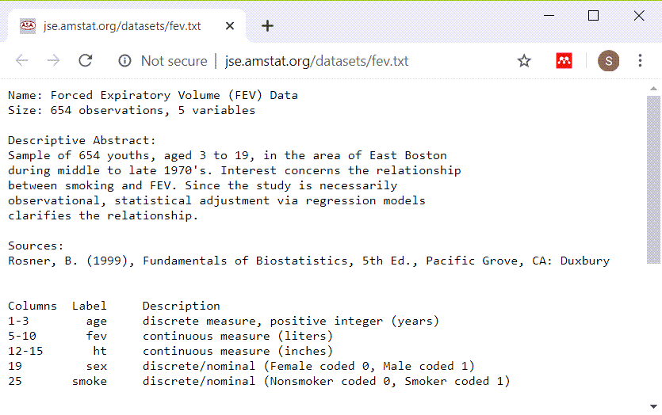
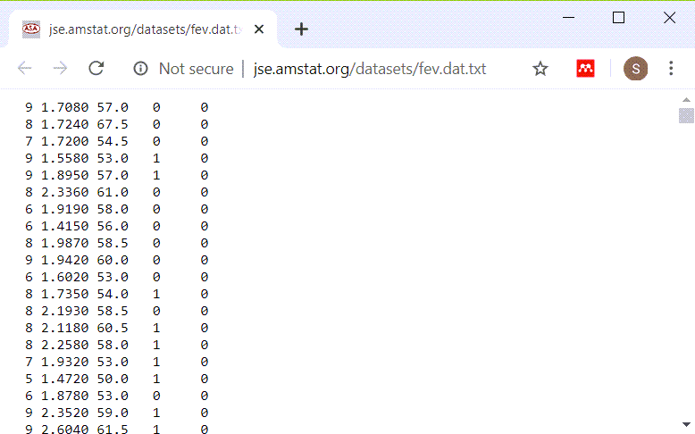
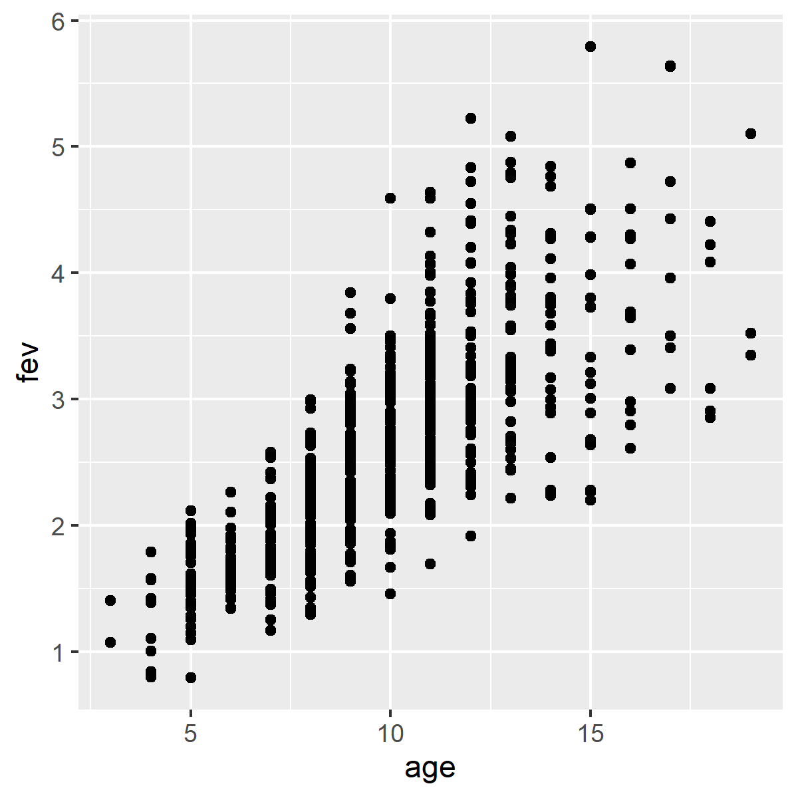
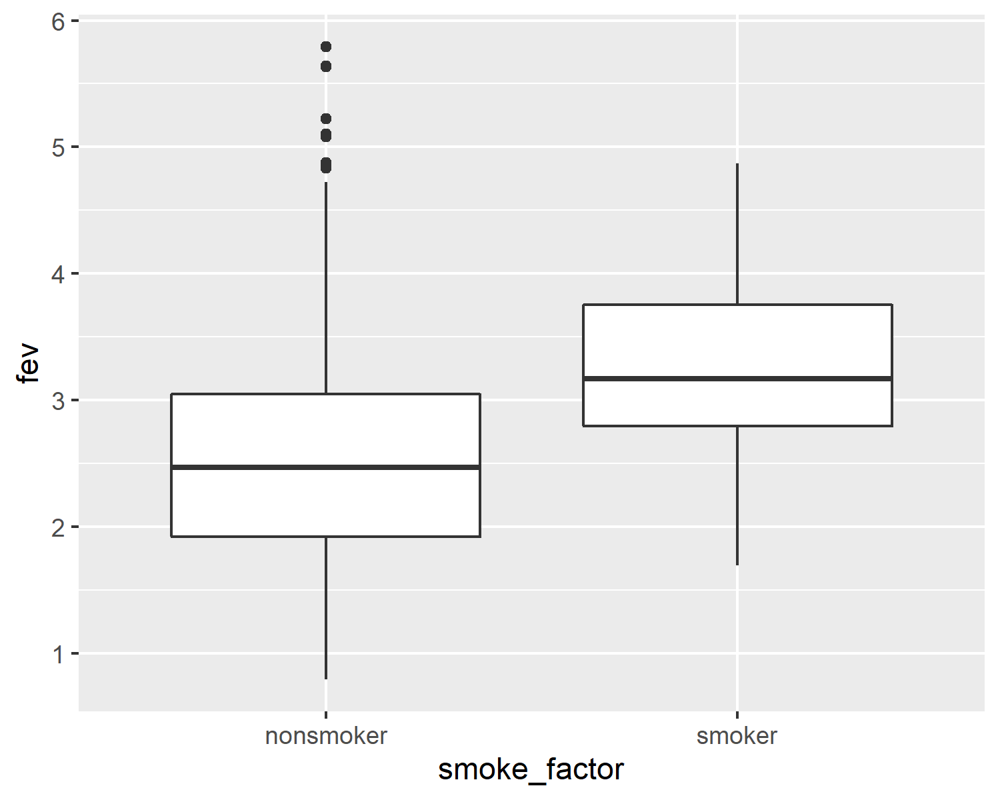
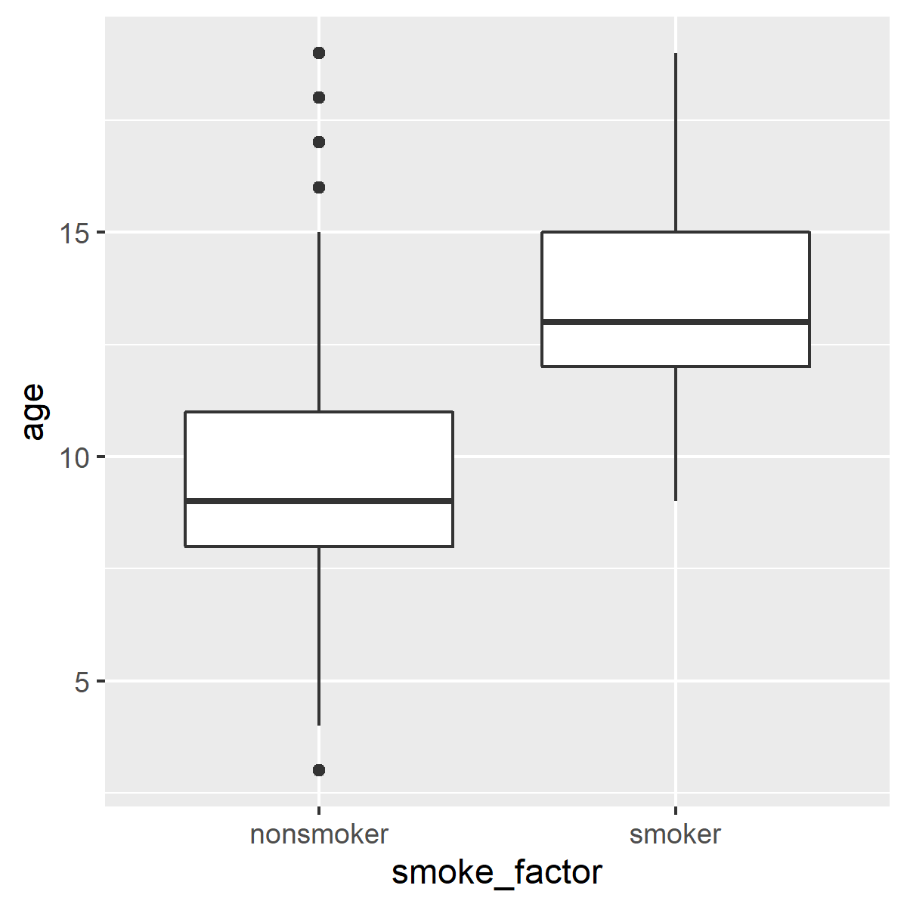
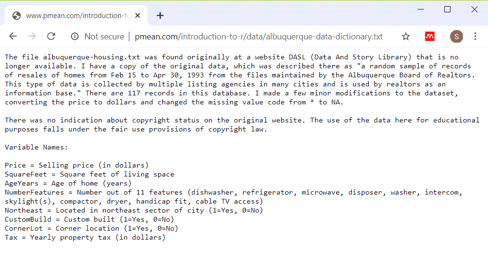
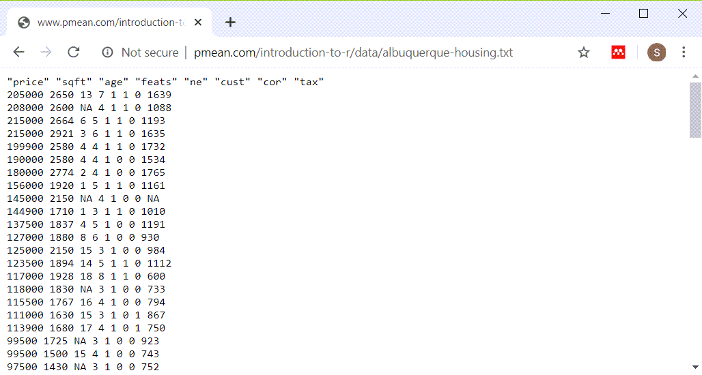
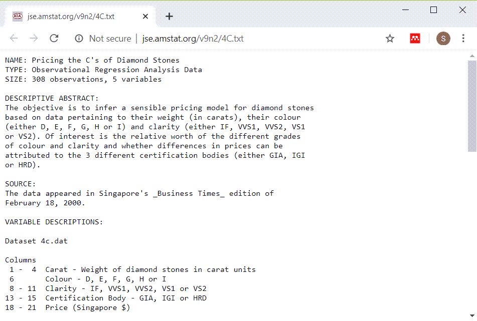
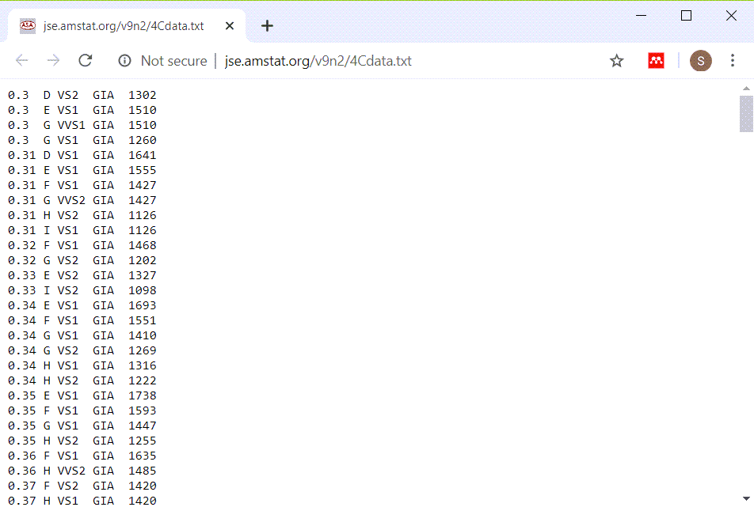

```{r setup, echo=FALSE}
knitr::opts_chunk$set(echo=TRUE)
``` 

<div class="notes"></div>### Introduction

This Powerpoint presentation was created using an R Markdown file.

```{r r-version-and-current-date}
R.version.string
Sys.Date()
```

<div class="notes">

Like the earlier presentations, this Powerpoint file was created using Rmarkdown.

</div>

### How do you characterize relationships?
+ Between two continuous variables
  + Correlations and scatterplots
+ Between two categorical variables
  + Crosstabulations
+ Between a continuous variable and a categorical variable
  + Boxplots
  
<div class="notes">

In an earlier module, you saw datasets that had mostly continuous variables. If you wanted to examine the relationship between two continuous variables, you would look at correlations and scatterplots.

Then in a different module, you saw datasets that had mostly categorical variables. If you wanted to examine the relationship between two categorical variables, you would look at crosstabulations.

In this module, you will see datasets that have a mix of continuous and categorical variables. If you want to examine the relationship between a continuous variable and a categorical variable, you would use a boxplot.

</div>

### FEV data
+ FEV dataset
  + http://www.amstat.org/publications/jse/datasets/fev.dat.txt
+ FEV data dictionary
  + http://ww2.amstat.org/publications/jse/datasets/fev.txt

<div class="notes">

The first data set looks at pumonary function in a group of children. The acronym FEV stands for Forced Expiratory Volume and represents how air you can blow out of your lungs.

</div>

### FEV data dictionary



<div class="notes">

This dataset has 654 rows and 5 variables: age (in years), fev (in liters), height (in inches), sex, and smoking status. Both sex and smoking status are categorical and use number codes. 

</div>

### Peek at FEV dataset



<div class="notes">

This is a listing of the first few rows. It could be a tab delimited file or a fixed width file. If you look carefully at the data, you will see that there are blanks and no tabs. So this is a file that you can read in most easily using a fixed width format.

</div>


### read in the FEV data set

```{r read_fev}
fn <- "http://www.amstat.org/publications/jse/datasets/fev.dat.txt"
fev <- read.fwf(file=fn, widths=c(3, 7, 5, 4, 6), header=FALSE, stringsAsFactors=FALSE)
names(fev) <- c("age","fev","ht","sex","smoke")
head(fev)
```

<div class="notes">

If you count carefully, you will see that the first three columns represent the first variable, you need seven more columns for the second variable, and so forth. Print out the first few lines of data to be sure.

</div>

### Display the bottom of FEV data

```{r fev-tail}
tail(fev)
```

<div class="notes">

It's always good to view the last few lines of data as well.

</div>

### Summary for continuous variables: age

```{r summary_age}
mean(fev$age)
sd(fev$age)
range(fev$age)
```

<div class="notes">

This is clearly a pediatric population.

</div>

### Summary for continuous variables: fev

```{r summary_fev}
mean(fev$fev)
sd(fev$fev)
range(fev$fev)
```

<div class="notes">

I am not an expert on FEV, but these values seem reasonable.

</div>

### Summary for continuous variables: ht

```{r summary_ht}
mean(fev$ht)
sd(fev$ht)
range(fev$ht)
```

<div class="notes">

Again, these seem to be reasonable values.

</div>

### Scatterplot

```{r fev_scatterplot}
library(ggplot2)
plot1 <- ggplot(fev, aes(x=age, y=fev)) +
  geom_point()
ggsave("../images/age-by-fev.png", plot1, width=4, height=4)
```

<div class="notes">

Recall that you use a scatterplot to examine the relationship between two continuous variables.

</div>

### Scatterplot



<div class="notes">

Here is the plot that is produced by this code.

</div>

### Create factors

```{r factors.fev}
fev$smoke_factor <- factor(
  fev$smoke, 
  levels=0:1,
  labels=c("nonsmoker", "smoker"))
fev$sex_factor <- factor(
  fev$sex, 
  levels=0:1,
  labels=c("female", "male"))
```

<div class="notes">

When you have number codes for categorical data, it is always a good idea to create factors. Remember, though, that you should not create factors until most of the data management tasks (e.g., recoding) is done.

</div>

### FEV frequency tables

```{r fev-tables}
table(fev$smoke_factor, useNA="always")
table(fev$sex_factor, useNA="always")
```

<div class="notes">

The two categorical variables have no missing values.

</div>

### Crosstabs

Also recall that you use a crosstabulation to examine the relationship between two categorical variables.

```{r fev_crosstabs}
crosstab <- table(fev$sex_factor,fev$smoke_factor)
prop_table <- prop.table(crosstab ,margin=1)
pct_table <- round(100*prop_table)
pct_table
```

<div class="notes">

The females smoke more often than the males, `r pct_table["female", "smoker"]`% versus `r pct_table["male", "smoker"]`%.

</div>

### Break #1

+ What have you learned
  + Review analysis of continuous variables
  + Review analysis of categorical variables
+ What's next
  + Analysis of a mix: continuous and categorical
  
<div class="notes">

Let's take a short break here. What you've seen so far is review of methods that you use when examining relationships between two continuous variables (scatterplots) and methods that you use when examining relationships between two categorical variables (crosstabulations).

Coming up next is how you examine relationships between a continuous variable and a categorical variable.

</div>

### Boxplots

```{r fev_boxplots-fev}
plot2 <- ggplot(fev, aes(x=smoke_factor, y=fev)) +
  geom_boxplot()
ggsave("../images/smoke-by-fev.png")
```

<div class="notes">

When you want to look at a relationship between a categorical variable and a continuous variable, you should use a boxplot.

</div>

### Boxplots



<div class="notes">

Here is the boxplot. The results are very odd. Smokers tend to have higher FEV values than non-smokers. 

You can get a hint as to why smokers might have higher fev values than non-smokers by looking at how age and smoking status are related.

</div>

### Boxplots

```{r fev_boxplots-age}
plot3 <- ggplot(fev, aes(smoke_factor, age)) +
  geom_boxplot()
ggsave("../images/smoke-by-age.png", plot3, height=4, width=4)
```

<div class="notes">

This is the code to draw a boxplot of the ages for smokers and non-smokers

</div>

### Boxplots



<div class="notes">

Here's what's happening. Older kids are more likely to be smokers, and older kids have bigger and more mature lungs. This a classic case of confounding.

</div>

### Break #2

+ What have you learned?
  + Boxplots
+ What's coming up next?
  + Group means and standard deviations
  
<div class="notes">

Time for another break. You saw how to use boxplots to visually compare a continuous variable across different levels of a categorical variable.

Coming up next is the calculation of group means and standard deviations.

</div>

### Group means

```{r fev_means}
fev_means <- by(fev$fev, fev$smoke_factor, mean, na.rm=TRUE)
fev_means
```

<div class="notes">

Here are the group means.

</div>

### Group standard deviations

```{r fev_sd}
fev_stdev <- by(fev$fev, fev$smoke_factor, sd, na.rm=TRUE)
fev_stdev
```

<div class="notes">

Here are the group standard deviations.

The output is not labelled all that clearly, but you can use the paste function to make things look nicer.

</div>

### Group means

```{r fev_paste_fev}
colon <- ": "
plus_minus <- "+/-"
paste(
  names(fev_means),
  colon,
  round(fev_means, 1),
  plus_minus,
  round(fev_stdev, 1),
  sep="")
```

<div class="notes">

You don't need to use this extra level of effort for your homework. It's just an attempt by me to show again a common pattern in R. Simple functions produce simple results and these can be combined in a variety of different ways.

</div>

### Group means

```{r fev_paste_age}
age_means <- by(fev$age, fev$smoke_factor, mean, na.rm=TRUE)
age_stdev <- by(fev$age, fev$smoke_factor, sd, na.rm=TRUE)
colon <- ": "
plus_minus <- "+/-"
paste(
  names(age_means),
  colon,
  round(age_means,1),
  plus_minus,
  round(age_stdev,1),
  sep="")
```

<div class="notes">

Let's calculate mean ages for smokers and nonsmokers. Notice that smokers are 4 years older on average than nonsmokers.

</div>

### Break #3

+ What have you learned?
  + Review earlier material
  + Boxplots
  + Group means and standard deviations
+ What's coming up next?
  + Datasets needed for your homework
  
<div class="notes">

Time for another break. You saw how to use boxplots to visually compare a continuous variable across different levels of a categorical variable.

Coming up next is the calculation of group means and standard deviations.

</div>

### The Albuquerque dataset

+ Housing data dictionary
  + http://www.pmean.com/introduction-to-r/data/albuquerque-data-dictionary.txt
+ Housing dataset
  + http://www.pmean.com/introduction-to-r/data/albuquerque-housing.txt

<div class="notes">

The first file you will need for your homework is the Albuquerque dataset. It has information on 117 housing resales in the city of Albuquerque, New Mexico back in 1993. The dataset includes information on the size and age of the house, among other things, that might be predictive of the sales price.

</div>

### The Albuquerque dataset



<div class="notes">

This is the data dictionary. Notice that there are several categorical variables. 

Northeast is an indicator variable for whether the house was located in the Northeast part of the city, which is believed to be slightly more upscale than the other parts of the city.

CustomBuild is an indicator variable for whether the house was built using special (custom) plans or if it was built using standard plans.

CornerLot is an indicator variable for whether the house sat on a corner lot (a lot at the intersection of two streets). There are reasons to believe that houses on corner lots should be more expensive than other houses, but also reasons to believe that these houses should be less expensive.

</div>

### The Albuquerque dataset



<div class="notes">

There is only a single blank between each data value. Use a blank as a delimiter.

</div>

### The Diamond dataset

+ Diamond data dictionary
  + http://jse.amstat.org/v9n2/4C.txt
+ Diamond dataset
  + http://jse.amstat.org/v9n2/4Cdata.txt
  
<div class="notes">

Note that the data dictionary describes two different datasets. You will be using the first dataset, the one with a smaller number of variables.

</div>

### The Diamond dataset



<div class="notes">

This is the data dictionary.

</div>

### The Diamond dataset



<div class="notes">

This could either be a tab delimited file or a fixed width file. If you scroll through enough of the data, you will see that most of the variables are left justified, but the price is right justified. Tab delimited files almost always have left justification for all data. So try a fixed width format.

</div>

```{r save-image, echo=FALSE}
save.image("../data/slides05.RData")
```
