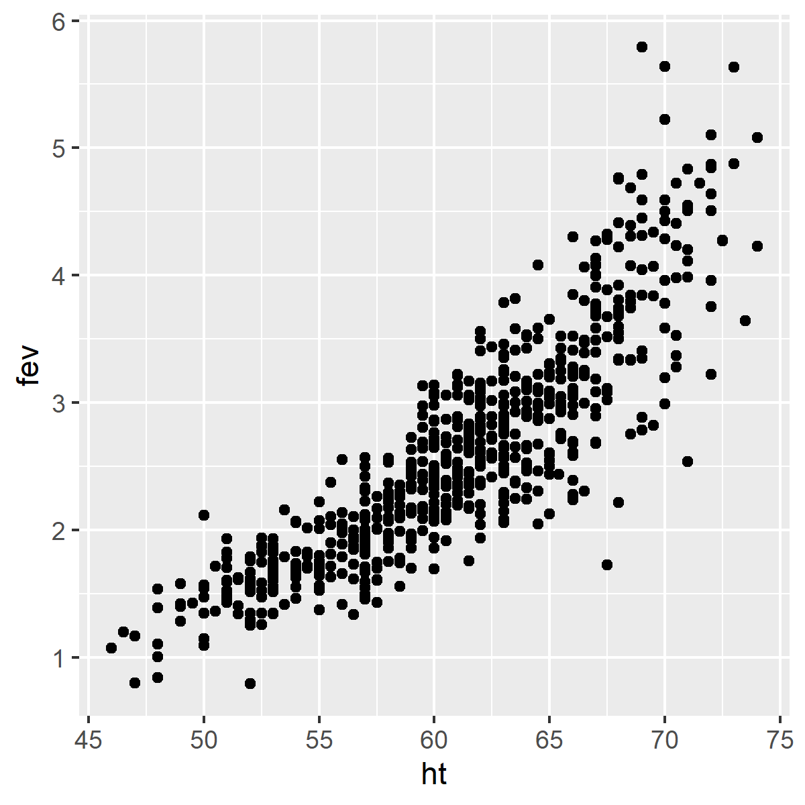

```{r setup, echo=FALSE}
knitr::opts_chunk$set(echo=TRUE)
``` 

<div class="notes"></div>### Introduction

This Powerpoint presentation was created using an R Markdown file.

```{r r-version-and-current-date}
R.version.string
Sys.Date()
```

<div class="notes">

Like the earlier presentations, this Powerpoint file was created using Rmarkdown.

</div>

### How do you characterize relationships?
+ Between two continuous variables
  + Correlations and scatterplots
+ Between two categorical variables
  + Crosstabulations
+ Between a continuous variable and a categorical variable
  + Boxplots
  
<div class="notes">

In an earlier module, you saw datasets that had mostly continuous variables. If you wanted to examine the relationship between two continuous variables, you would look at correlations and scatterplots.

Then in a different module, you saw datasets that had mostly categorical variables. If you wanted to examine the relationship between two categorical variables, you would look at crosstabulations.

In this module, you will see datasets that have a mix of continuous and categorical variables. If you want to examine the relationship between a continuous variable and a categorical variable, you would use a boxplot.

</div>

### FEV data
+ FEV dataset
  + http://www.amstat.org/publications/jse/datasets/fev.dat.txt
+ FEV data dictionary
  + http://ww2.amstat.org/publications/jse/datasets/fev.txt

<div class="notes">

The first data set looks at pumonary function in a group of children. The acronym FEV stands for Forced Expiratory Volume and represents how air you can blow out of your lungs.

</div>

### FEV data dictionary


<div class="notes">

This dataset has 654 rows and 5 variables: age (in years), fev (in liters), height (in inches), sex, and smoking status. Both sex and smoking status are categorical and use number codes. 

</div>

### Peek at FEV dataset


<div class="notes">

This is a listing of the first few rows. It could be a tab delimited file or a fixed width file. If you look carefully at the data, you will see that there are blanks and no tabs. So this is a file that you can read in most easily using a fixed width format.

</div>


### read in the FEV data set

```{r read_fev}
fn <- "http://www.amstat.org/publications/jse/datasets/fev.dat.txt"
fev <- read.fwf(file=fn, widths=c(3, 7, 5, 4, 6), header=FALSE, stringsAsFactors=FALSE)
names(fev) <- c("age","fev","ht","sex","smoke")
head(fev)
```

<div class="notes">

If you count carefully, you will see that the first three columns represent the first variable, you need seven more columns for the second variable, and so forth. Print out the first few lines of data to be sure.

</div>

### Display the bottom of FEV data

```{r fev-tail}
tail(fev)
str(fev)
```

<div class="notes">

It's always good to view the last few lines of data as well.

</div>

### Summary for continuous variables: age

```{r summary_age}
mean(fev$age)
sd(fev$age)
range(fev$age)
```

<div class="notes">

This is clearly a pediatric population.

</div>

### Summary for continuous variables: fev

```{r summary_fev}
mean(fev$fev)
sd(fev$fev)
range(fev$fev)
```

<div class="notes">

I am not an expert on FEV, but these values seem reasonable.

</div>

### Summary for continuous variables: ht

```{r summary_ht}
mean(fev$ht)
sd(fev$ht)
range(fev$ht)
```

<div class="notes">

Again, these seem to be reasonable values.

</div>

### Scatterplot

```{r fev_scatterplot, eval=FALSE}
library(ggplot2)
plot1 <- ggplot(fev, aes(x=ht, y=fev)) +
  geom_point()
ggsave("../images/ht-by-fev.png", plot1, width=4, height=4)
```

<div class="notes">

Recall that you use a scatterplot to examine the relationship between two continuous variables.

</div>

### Scatterplot



<div class="notes">

Here is the plot that is produced by this code.

</div>

### Create factors

```{r factors.fev}
fev$smoke_factor <- factor(
  fev$smoke, 
  levels=0:1,
  labels=c("nonsmoker", "smoker"))
fev$sex_factor <- factor(
  fev$sex, 
  levels=0:1,
  labels=c("female", "male"))
```

<div class="notes">

When you have number codes for categorical data, it is always a good idea to create factors. Remember, though, that you should not create factors until most of the data management tasks (e.g., recoding) is done.

</div>

### FEV frequency tables

```{r fev-tables}
table(fev$smoke_factor, useNA="always")
table(fev$sex_factor, useNA="always")
```

<div class="notes">

The two categorical variables have no missing values.

</div>

### Crosstabs

Also recall that you use a crosstabulation to examine the relationship between two categorical variables.

```{r fev_crosstabs}
crosstab <- table(fev$sex_factor,fev$smoke_factor)
prop_table <- prop.table(crosstab ,margin=1)
pct_table <- round(100*prop_table)
pct_table
```

<div class="notes">

The females smoke more often than the males, `r pct_table["female", "smoker"]`% versus `r pct_table["male", "smoker"]`%.

</div>

### Boxplots

When you want to look at a relationship between a categorical variable and a continuous variable, you should use a boxplot.

```{r fev_boxplots-fev}
boxplot(fev~smoke_factor,data=fev)
```

This is very odd. You can get a hint as to why smokers might have higher fev values than non-smokers by looking at how age and smoking status are related.

```{r fev_boxplots-age}
boxplot(age~smoke_factor,data=fev)
```


<div class="notes">


</div>

### On your own

Look at the relationship between sex and fev.

You should also calculate the means for each continuous variable within each level of the categorical variable.

Note: you don't really need the na.rm=TRUE argument here, but you might in other examples.

```{r fev_by_fev}
# fev mean by smoke_factor
by(fev$fev,fev$smoke_factor,mean,na.rm=TRUE)
# fev standard deviation by smoke_factor
by(fev$fev,fev$smoke_factor,sd,na.rm=TRUE)
```

The output is not labelled all that clearly, but you can use the paste function to make things look nicer.

```{r fev_paste_fev}
grp_means <- by(fev$fev,fev$smoke_factor,mean)
grp_stdev <- by(fev$fev,fev$smoke_factor,sd)
colon <- ": "
plus_minus <- "+/-"
paste(names(grp_means),colon,round(grp_means,1),
      plus_minus,round(grp_stdev,1),sep="")
```

Let's calculate mean ages for smokers and nonsmokers. Notice that smokers are 4 years older on average than nonsmokers.

```{r fev_paste_age}
grp_means <- by(fev$age,fev$smoke_factor,mean)
grp_stdev <- by(fev$age,fev$smoke_factor,sd)
colon <- ": "
plus_minus <- "+/-"
paste(names(grp_means),colon,round(grp_means,1),
      plus_minus,round(grp_stdev,1),sep="")
```

<div class="notes">


</div>

### On your own

Compute the mean and standard deviation for fev by sex.

<div class="notes">


</div>

### Read in the housing data set

You should find the data file on housing prices in Albuquerque at

--> http://lib.stat.cmu.edu/DASL/Datafiles/homedat.html

You should cut-and-paste the actual data to notepad and save it with the name housing.txt. You need to read in the file using the read.table function.

For technical reasons, you want the as.is=TRUE argument. Otherwise AGE and TAX are converted to factors which causes all sorts of grief.

```{r read.housing}
al <- read.table(file="../data/housing.txt",header=TRUE,as.is=TRUE)
head(al)
tail(al)
```

```{r univariate}
summary(al)
```

There is a problem with AGE. The person who entered the data intended for an asterisk to represent a missing value. But R interpreted the asterisk as a string and converted all the numeric ages to strings also. That's why R summarizes age using counts rather than means. Use the as.numeric function to fix this.

A side effect, which is desired in this case, is that anything that cannot be converted from a string to a number (like an asterisk) is instead converted to a missing value.

```{r convert_age}
al$age_years <- as.numeric(al$AGE)
summary(al$age_years)
```

There is a mix of categorical and continuous variables. Recall that you use a scatterplot to examine the relationship between two continuous variables, a crosstabls and an odds ratio to examine the relationship between two categorical variables, and a boxplot to examine the relationship between a categorical variable and a continuous variable.

<div class="notes">


</div>

### On your own

1. Convert the asterisks in the TAX variable to missing. How many missing values are there for AGE and for TAX?

2. Create factors for NE, CUST, and COR. Draw bar charts for each of these factors.

3. Find the largest house (biggest SQFT) in the data set. Is the largest house also the most expensive house?

4. Calculate frequency counts for FEATS. Are there any houses with the no features? Are there any houses with every possible feature?

5. Evaluate the relationship between PRICE and SQFT using a scatterplot. Include a smooth curve. Do larger houses tend to cost more?

6. Evaluate the relationship between CUST and PRICE using a boxplot. Calculate the mean price and standard deviation by CUST.

7. What is the difference in average prices between northeast houses and other houses? What is the difference in average taxes?

8. Are custombuilt houses more likely to appear on corner lots? Calculate the percentages and compute a relative risk.

9. Place all the key results into a Word document, add a bit of commentary, and turn it in.

<div class="notes">


</div>

### A third data set

If there is time, we can explore a third data set, diamond prices. The data is at 

--> http://www.amstat.org/publications/jse/v9n2/4cdata.txt

and a description is at 

--> http://www.amstat.org/publications/jse/v9n2/4c.txt

<div class="notes">


</div>

```{r save-image, echo=FALSE}
save.image("../data/slides05.RData")
```
